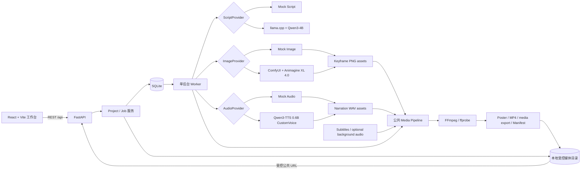
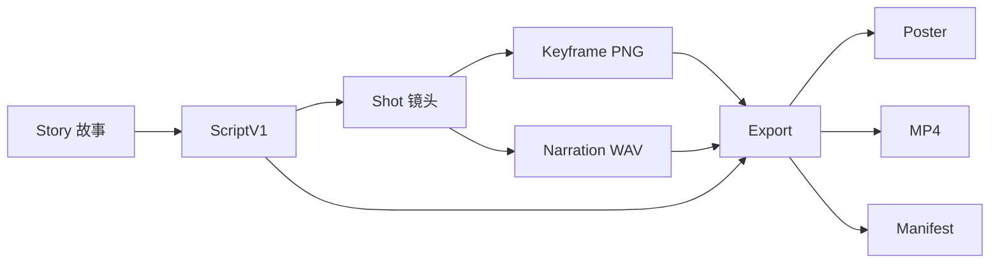
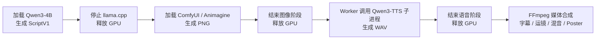

# 系统架构

## 架构目标

纸鹤工坊采用单机模块化架构：用较少的运行组件完成真实多模型编排，同时保留任务快照、失败边界和媒体追溯。当前实现不是微服务系统，也不依赖 Redis、Celery 或 Kubernetes。

## 运行架构

前端只通过 REST API 访问项目、任务和公开媒体 URL，不接触模型权重或绝对本地路径。FastAPI 负责校验请求、冻结 Job 快照和查询结果；单 Worker 顺序领取 Job，调用对应 Provider 或媒体流水线；SQLite 保存业务状态，本地受控目录保存生成素材和 Manifest。

## 数据流

`ScriptV1` 是模型输出与下游生产之间的稳定边界。镜头 ID 将结构化剧本、关键帧、旁白、字幕和 TimingPlan 对齐。Export 不只返回 MP4，还提供 Poster 与 Manifest；Manifest 记录素材来源、Provider、模型、哈希、时序、运动模式、背景音和复用语义。

## Provider 与 Job

### Provider 抽象

- `ScriptProvider`：故事与参数输入，输出通过校验的 `ScriptV1`。
- `ImageProvider`：消费 ScriptV1 镜头信息，输出逐镜头 PNG 与生成元数据。
- `AudioProvider`：消费逐镜头旁白文本，输出逐镜头 WAV 与音色、时长等元数据。
- Media Pipeline：不是生成模型 Provider；它消费已生成素材，通过 FFmpeg 输出成片。

每类生成能力同时保留 Mock 与真实实现。Mock 用于确定性离线开发；真实 Provider 失败会保留失败状态和结构化原因，不会静默回退为 Mock 成功。当前 ID 和验证状态见 [模型与 Provider](model-providers.md)。

### Job 快照与重试

创建 Job 时会把 Provider、模型选择、来源 Job、运动模式、背景音引用和音量等配置冻结到请求快照。Worker 依据快照执行，避免运行过程中全局配置变化改变任务语义。重试复制原任务快照，因此沿用原来源和参数；旧 Job 没有新增字段时由兼容逻辑维持其历史行为，不会被后台静默改写。

Job 状态、阶段、进度、错误和结果进入 SQLite；体积较大的 PNG、WAV、MP4 和 Manifest 存入项目隔离的本地目录。媒体 API 会验证项目归属、受控根目录和文件类型，不向浏览器暴露绝对路径。

## 8GB GPU 交接

RTX 4060 8GB 无法稳妥地让三类模型同时驻留。平台因此把产物持久化为阶段边界：后一阶段只读取前一阶段已经完成的文件和快照。界面展示 GPU 冲突和建议动作，但不会擅自结束用户启动的外部进程。

模型不需要同时驻留：播放已有结果和执行 `MEDIA_RERENDER` 只需 FastAPI、Worker 和 FFmpeg，不需要启动 Qwen 或 ComfyUI，也不会触发 Qwen3-TTS 推理子进程。

## MEDIA_RERENDER

`MEDIA_RERENDER` 是专门的 media-only Job。它只接受同一项目内成功的真实素材来源，校验 ScriptV1、真实 Animagine PNG 和真实 Qwen3-TTS WAV 后进入公共媒体流水线。它不会创建或调用 Script、Image、Audio Provider，也不会在素材缺失时回退 Mock。

任务快照记录三个来源 Job、`media_only=true`、三类 `provider_calls_expected=0`、运动模式和背景音配置。Manifest 使用 `m6.media-export.v1`，记录 `reused_providers`、`provider_calls` 和逐镜头 `media_reuse`，从而区分“素材最初由真实模型生成”与“本次导出复用了素材”。

## 媒体流水线

公共 FFmpeg 层负责：

- 1280x720、24fps 输出和符合 TimingPlan 的镜头拼接。
- `static`、`gentle_zoom`、`cinematic_pan` 三种确定性运动模式。
- 中文字幕烧录和逐镜头旁白拼接。
- 可选用户背景音的循环/裁剪、淡入淡出和旁白 ducking。
- MP4 校验、Poster 抽帧和 Manifest 写入。

Mock 与真实素材共用该媒体实现。Poster 失败会记录 warning，不应使已经成功的 MP4 失效。

## 可追溯性

平台通过以下信息形成可审计链路：

- Job ID、类型、请求快照、父任务和来源任务。
- Provider ID、模型 ID、来源类型和调用次数。
- ScriptV1、镜头 ID、TimingPlan 和字幕文本。
- PNG/WAV/背景音/Poster/MP4 的路径约束与 SHA256。
- 运动模式、背景音量、ducking 和导出版本。

这套追溯信息默认折叠在界面的“运行与追溯”区域，演示主视图优先展示故事、镜头、音频和最终视频。

## 取舍与扩展边界

单 Worker 与 SQLite 适合当前开发范围、单机 GPU 串行调度和可重复演示。它们不是多租户或大规模并发方案。若未来进入工作站或云端场景，可以在保持 Provider、Job 快照和 Media 契约的前提下替换执行基础设施；该方向尚未在本项目验证，详见 [模型升级指南](model-upgrade-guide.md) 与 [已知限制](limitations.md)。
