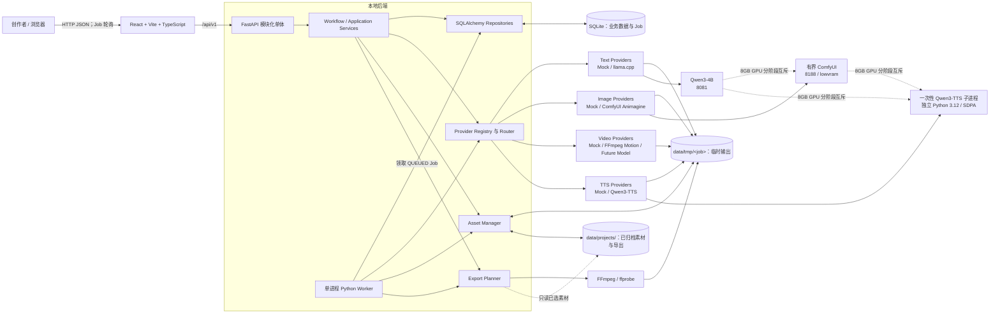
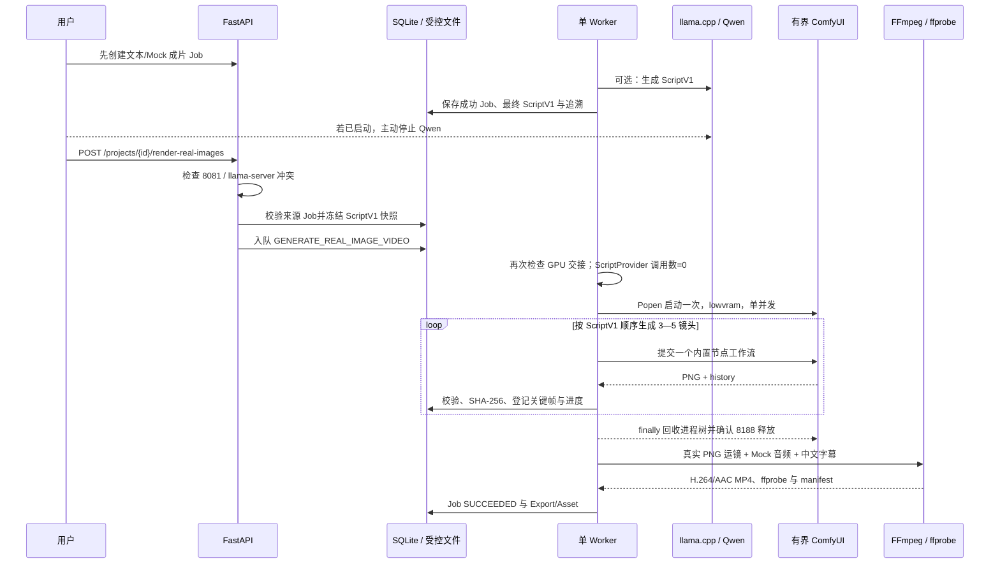
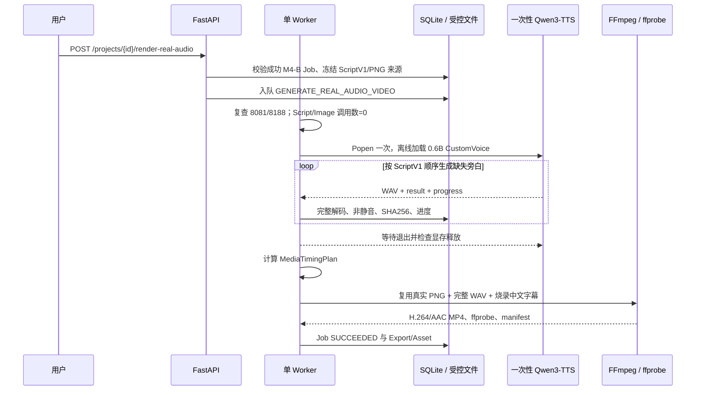
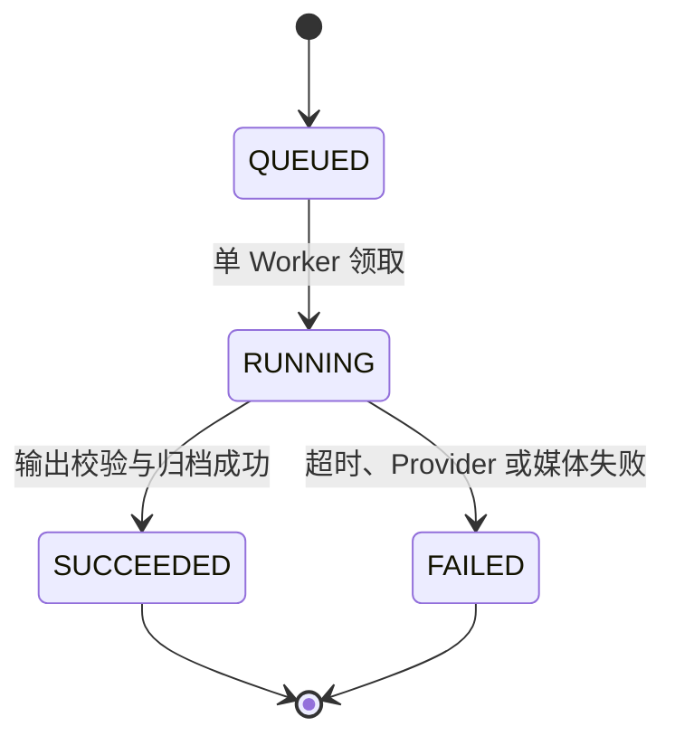

# 系统架构设计

## 1. 架构目标

本架构优先解决四件事：

1. 在 Windows 笔记本上稳定跑通完整垂直链路。
2. 真实模型、Mock 和确定性兜底共享业务契约，单个外部故障不阻断演示。
3. 先让所有耗时任务可观察、失败可诊断并可手动重试，再按风险增加恢复、取消和竞争语义。
4. 尽快产出第一段 MP4；当前范围只是实现上限，避免不必要的分布式基础设施。

系统采用“模块化单体 + 独立 Worker”：React 前端、FastAPI API 和 Python Worker 是三个本地进程，共享一个 SQLite 数据库和受控 `data/` 素材根目录。模型服务可以是 Worker 进程内实现、单独的本地 HTTP 服务或远程 API，但都位于 Provider 接口之后。

### 1.1 实施层级

本文保留完整架构作为**目标设计**，但编码必须分层：

- **M1 首段成片**：最小 Provider DTO、Mock 文件、FFmpeg/ffprobe；不等待完整 UI 或数据库高级字段。
- **P0 工程保底**：React 最小工作流、FastAPI、SQLite、单 Worker、七个核心实体，Job 只用 `QUEUED/RUNNING/SUCCEEDED/FAILED`，支持手动重试。
- **稳定后增强**：`RETRY_WAIT`、取消、租约/心跳、崩溃恢复、客户端幂等键、复杂 CAS、STAGING 两阶段归档、Provider 多次调用历史和完整 Export 失效竞争。

因此，后文出现上述高级机制时均应理解为目标设计，除非明确标为 P0。它们不得成为 M1 或 P0 开工门槛。

## 2. 总体架构



图中的 Provider 只能把输出写入系统分配的当前 Job 受控目录；P0 Mock 路径使用临时目录再登记素材，M4-B 真实图像路径使用 `jobs/<job>/images/`，M5-B 真实旁白路径使用 `jobs/<job>/audio/`，均不能写任意用户路径。FFmpeg Exporter 是媒体合成服务，不伪装成“大模型”；真实关键帧、真实语音和 Mock 素材分别记录来源，不能因为最终都由 FFmpeg 编码就混淆 Provider 身份。

## 3. 进程与部署边界

| 进程 | 职责 | 不负责 |
|---|---|---|
| Web 前端 | 工作流导航、编辑、素材预览选择、Job 状态、导出播放和追溯展示 | 不保存密钥、不拼本地路径、不直接调用模型或 FFmpeg |
| FastAPI | 校验、CRUD、工作流门禁、创建 Job、Provider 配置检查、受控文件下载 | 不在请求线程执行耗时生成、不启动重复 Worker |
| Python Worker | P0 单并发领取 Job、调用 Provider、超时、校验输出和执行 FFmpeg；增强阶段加入取消、租约/心跳与恢复 | 不提供用户界面、不长期持有数据库事务 |
| 可选模型服务 | 通过本机回环 HTTP 提供模型推理 | 不访问业务数据库、不决定工作流 |

开发期可以分别启动三个进程。FastAPI 的 `--reload` 不得顺带拉起 Worker，否则 Windows 重载会产生重复 Worker。第一版默认绑定 `127.0.0.1`，不把系统暴露到局域网或公网。

### 3.1 M4-B 的 GPU 分阶段边界

RTX 4060 Laptop 8GB 无法把 M3 Qwen 与 M4 Animagine 同时作为常驻 GPU 服务。M4-B 因而采用两个独立 Job，而不是在一个 Worker 调用中先后热切换两个模型：



API 与 Worker 都执行 GPU 交接检查，以覆盖“入队后、执行前又启动 Qwen”的竞争窗口。发现 8081 监听或 `llama-server` 进程时返回 `GPU_HANDOFF_REQUIRED`；平台不杀外部进程、不强行启动 ComfyUI，也不把任务改成 Mock。ComfyUI 只绑定回环地址 8188，由 Worker 的有界上下文负责启动和结束，不需要用户手工常驻。

### 3.2 M5-B 的一次性 TTS 子进程边界

M5-B 在 M4-B 后增加第三个 GPU 阶段。成功真实图像 Job 已经冻结 ScriptV1 与 PNG，用户停止 Qwen、确认 ComfyUI 已退出后，才创建 `GENERATE_REAL_AUDIO_VIDEO` 子 Job。FastAPI 校验 8081/8188、已知模型进程、整卡显存和来源 Job，Worker 执行前再次校验；默认前置显存占用阈值为可配置的 2048 MiB。冲突只返回 `GPU_HANDOFF_REQUIRED`，不杀用户进程。

Python 3.11 后端不导入 `qwen_tts` 或 PyTorch。`Qwen3TTSAudioProvider` 通过参数列表、`shell=False` 启动 `.venv-qwen3-tts` 中的 Python 3.12 和 `scripts/qwen3_tts_job_runner.py`。一次子进程对应一个 3—5 镜头 Job：固定离线本地模型、只加载一次、单并发顺序生成所有缺失 WAV；模型加载、单镜头和 Job 总时长分别有界。父进程持续读取进度文件，捕获 stdout/stderr，并在成功、错误或超时后等待和回收自己启动的进程。它不启动 Gradio/FastAPI 服务，也不与 Qwen 或 ComfyUI 同驻 GPU。



## 4. 模块划分

以下是下一阶段建议的逻辑模块，不代表本阶段已经创建代码目录：

| 模块 | 核心职责 |
|---|---|
| `api` | `/api/v1` 路由、Pydantic 请求响应、错误映射、文件流响应 |
| `domain` | Project、Shot、Asset、Job 等实体规则与统一枚举 |
| `application` | 用例编排与基础阶段门禁；复杂 stale 传播、客户端幂等键和请求指纹为增强 |
| `repositories` | SQLAlchemy 查询、短事务、单 Worker Job 领取、迁移入口；多领取者 CAS 为增强 |
| `providers` | 强类型接口、注册表、能力与健康检查、Mock / 本地 / 远程 Adapter |
| `jobs` | P0 入队、四态 Worker 循环和手动重试；租约、心跳、自动重试、取消和故障恢复为增强 |
| `assets` | 临时文件、格式验证、SHA-256、同卷原子替换、相对路径安全；可恢复两阶段归档为增强 |
| `media` | 运镜片段、规格统一、字幕时轴、音频补齐、FFmpeg 参数构建、ffprobe 验证 |
| `prompts` | 版本化提示词模板、模板哈希、Schema 和渲染逻辑 |
| `config` | 环境变量、非敏感设置、Provider 配置解析与脱敏 |
| `observability` | 结构化日志、错误码、耗时、Job 事件和敏感字段过滤 |

模块间通过应用服务和接口协作，不能让 API 路由直接拼 FFmpeg 命令或让 Provider 直接更新多张业务表。

## 5. 前后端职责

### 5.1 前端

- 提供项目列表和单项目阶段式工作区。
- 剧本、角色、场景和分镜采用表单或卡片编辑，不做自由时间线。
- 显示每个阶段的进入条件、缺失项、revision 和过期资产。
- 显示关键帧候选并让用户明确选择，不因重新生成覆盖旧选择。
- M5-B 在成功真实图像 Job 下提供 Serena（默认）/Vivian 音色选择、逐段音频进度、延长镜头和真实/Mock 音频徽标；Job 入队后不再用当前 UI 值覆盖快照。
- 以 1—2 秒轮询 Job；SSE 是加分项，不作为第一版依赖。
- 对错误显示用户可执行建议，例如“密钥未配置”“显存不足，请切换 Mock”“字幕滤镜不可用”。
- 在资产、Job 和导出页面持续显示 `MOCK`、`DETERMINISTIC_FALLBACK`、`LOCAL_MODEL`、`REMOTE_API`、`USER_UPLOAD`、`DEMO_FIXTURE` 或 `SYSTEM_DERIVED`。
- 只接收资产 ID 和下载 URL，不接触服务器绝对路径。

### 5.2 FastAPI

- 用 Pydantic 和业务规则双层校验请求。
- 把已审核剧本规范化到 Character、Scene、Shot 表，避免同时维护另一份权威 `script_json`。
- P0 创建带必要业务快照的 Job，并立即返回 `202 Accepted` 与 Job ID；请求指纹和客户端幂等键为增强。
- 检查下游门禁并解释具体缺项。
- M5-B 只接受成功 M4-B 来源，服务端派生 Script/Image 来源关系并冻结快照；不相信客户端自行声明上游 Provider。
- 提供受控素材下载，校验 Project 与 Asset 归属。
- 返回 Provider 能力和 `configured: true/false`，绝不返回密钥值。
- 对日志、Provider 原始错误和命令参数做脱敏。

### 5.3 Worker

- 默认一个 Worker、并发度 1；未来即使增加 CPU 任务并发，GPU semaphore 仍保持 1。
- P0 在单 Worker 下用短事务领取 QUEUED Job；多领取者条件竞争、租约与心跳在增强阶段实现。
- 在事务外调用模型或 FFmpeg，防止长时间占用 SQLite 写锁。
- P0 检查 timeout 和 Provider 错误分类，校验格式、大小、时长和哈希后，以临时文件加同卷原子替换归档，并把 Job 置为 SUCCEEDED 或 FAILED。
- 增强阶段再实现 STAGING 可恢复归档、依赖指纹 CAS、编辑/成功竞争、取消、租约回收和 attempt/Provider call 历史。

## 6. 建议 API 表面

| 方法与路径 | 用途 |
|---|---|
| `POST /api/v1/projects` | 新建项目 |
| `GET/PATCH /api/v1/projects/{id}` | 查看或编辑项目 |
| `POST /api/v1/projects/{id}/script-jobs` | 创建结构化剧本 Job |
| `POST /api/projects/{id}/render-real-images` | M4-B：复用成功 Job 的 ScriptV1，创建真实图像成片子 Job；不调用 ScriptProvider |
| `POST /api/projects/{id}/render-real-audio` | M5-B：复用成功 M4-B Job 的 ScriptV1 与真实 PNG，选择 Serena/Vivian 创建真实旁白成片子 Job；不调用 ScriptProvider/ImageProvider |
| `PUT /api/v1/projects/{id}/script` | 保存审核后的角色、场景和分镜 |
| `POST /api/v1/shots/{id}/keyframe-jobs` | 生成关键帧候选 |
| `POST /api/v1/shots/{id}/selected-keyframe` | 选择关键帧 |
| `POST /api/v1/shots/{id}/clip-jobs` | 生成镜头片段 |
| `POST /api/v1/shots/{id}/selected-clip` | 选择镜头片段 |
| `POST /api/v1/shots/{id}/speech-jobs` | 生成镜头音频 |
| `POST /api/v1/shots/{id}/selected-audio` | 选择镜头音频 |
| `POST /api/v1/projects/{id}/export-jobs` | 创建导出 Job |
| `GET /api/v1/projects/{id}/assets` | 按 Shot、类型和状态查询候选素材 |
| `GET /api/v1/projects/{id}/jobs` | 重新打开项目后查询任务历史 |
| `GET /api/v1/jobs/{id}` | 查询状态、进度和错误 |
| `POST /api/v1/jobs/{id}/cancel` | 稳定后增强：请求取消 |
| `POST /api/v1/jobs/{id}/retry` | 从终态 Job 创建显式重试 |
| `GET /api/v1/assets/{id}/content` | 受控读取素材 |
| `GET /api/projects/{project_id}/assets/{asset_id}/content` | M4-B：按项目归属受控读取真实 PNG 缩略图 |
| `GET /api/v1/providers` | 查询 Provider 能力和健康状态 |
| `GET /api/v1/exports/{id}` | 查询、播放或下载导出与 manifest |

该表是目标 API 摘要，不是要求 M1 或 P0 一次实现的完整 OpenAPI。P0 只实现纵向链路实际调用的子集；项目详情包含 Character、Scene、Shot 和当前选择。ProviderConfig 第一版直接从受控配置文件和环境变量读取，API 即使暴露也只读，不做密钥写入页面。

客户端 `Idempotency-Key`、请求指纹冲突和复杂条件更新属于稳定后增强。P0 允许每次明确点击创建一个新 Job；手动重试创建新 Job 并记录 `retry_of_job_id`，前端在请求进行中禁用重复点击。增强阶段再为 HTTP 重发加入唯一键语义。

## 7. Provider 抽象

### 7.1 不采用万能 `generate()`

文本、图像、视频和语音的输入输出差异明显。一个塞满可选字段的万能接口会把错误推迟到运行时，因此采用公共上下文 + 四个强类型接口：

```text
TextProvider.generate_script(ScriptRequest) -> ScriptResult
ImageProvider.generate_keyframe(ImageRequest) -> MediaResult
VideoProvider.generate_clip(VideoRequest) -> MediaResult
TTSProvider.synthesize(SpeechRequest) -> MediaResult
```

每个 Provider 还必须提供：

```text
descriptor() -> ProviderDescriptor
capabilities() -> CapabilitySet
healthcheck() -> HealthResult
```

### 7.2 公共请求上下文

```text
run_id, job_id, project_id, shot_id
schema_version
dependency_schema_version, dependency_fingerprint
prompt_template_id, prompt_template_version, prompt_template_sha256
rendered_prompt, negative_prompt
input_asset_ids, input_asset_sha256
parameters
requested_seed
timeout_seconds
temporary_output_dir
```

各类型再增加自己的必填字段，例如 ScriptRequest 的故事与 JSON Schema、ImageRequest 的宽高和角色约束、VideoRequest 的关键帧和时长、SpeechRequest 的文本、语言和目标时长。

### 7.3 公共结果

```text
provider_id, implementation_id, provider_request_id
model_id, model_revision
actual_seed
output_descriptors
usage
finish_reason
warnings
sanitized_raw_metadata
```

- `model_revision` 无法取得时为 `unknown`，不得伪造。
- `actual_seed` 仅在 Provider 返回或能够确定时记录；请求 seed 不等于可复现承诺。
- `usage` 只保存官方响应提供的 token、计费或耗时字段，不自行编造成本。
- Provider 不得静默 fallback。Router/Policy 层决定下一 Provider，并记录完整 attempt 链。

### 7.4 Mock 设计

- `MockTextProvider`：基于固定模板和输入哈希产生合法 JSON，能配置延迟、暂态失败和永久失败。
- `MockImageProvider`：基于 seed 生成确定性的有效 PNG 占位图，不依赖模型权重。
- `MockVideoProvider`：生成契约正确的测试短片，用于错误与状态机测试。
- `FfmpegMotionVideoProvider`：把已选择关键帧转换为正式可用镜头，是演示视频兜底而不是 Mock。
- `MockTTSProvider`：生成匹配目标时长的合法 WAV 提示音或静音，元数据和界面明确“非语义语音”。

Mock 输出必须是后续模块能够真实读取的文件格式，不能只返回假 URL 或空文件。

### 7.5 M4-B ImageProvider 实际契约

M4-B 在通用 `ImageProvider` 上冻结了独立于 ScriptProvider 的强类型 DTO：

```text
ImageGenerationRequest
  project_id, job_id, ScriptV1, shot, characters, scene,
  output_dir, ImageGenerationOptions

ImageGenerationOptions
  width, height, steps, cfg, sampler, scheduler, denoise,
  batch_size, base_seed, lowvram,
  startup_timeout_seconds, generation_timeout_seconds,
  job_timeout_seconds, http_timeout_seconds

GeneratedImageAsset
  provider_id, model_id, shot_id, image_path, width, height,
  seed, positive_prompt, negative_prompt, generation_seconds,
  image_sha256, model_sha256, workflow_path, trace_path,
  warnings, reused
```

正式实现包括：

- `MockImageProvider` 继续服务于 M0—M3 的确定性离线保底，其输出不能被真实图像入口冒充或混用。
- `ComfyUIImageProvider` 的 ID 固定为 `comfyui-animagine-xl-4`，模型 ID 与 SHA256 来自配置快照；运行前重新计算权重 SHA256，不匹配则拒绝加载。
- `generate_batch()` 只接受同一 Project、同一 Job、相同参数、按 index 连续排序的 3—5 个镜头；进程内锁和单 Worker共同把并发固定为 1。
- 一个 Job 只创建一个 `ComfyUIJobSession`，在同一进程中按顺序提交镜头工作流，避免每张图重复启动和加载模型；如重试时所有镜头均已验证可复用，则无需再次启动 ComfyUI。
- 每张图的 seed 为 `base_seed + shot.index`，不使用 Python 运行时 `hash()`；手动重试复制原请求快照并验证旧图，因此 seed 不变。
- 正向提示按“质量标签、项目风格、共享角色外观锚点、场景、镜头视觉描述、`image_prompt`、构图、横向动漫关键帧”分层构造。相同 Character 的核心外观锚点逐字复用，但这只是基础提示一致性，不是严格角色一致性。
- 负向提示、原始中文字段、最终英文标签、工作流、参数、seed、模型/图片哈希和警告全部落盘。当前中文转英文是可审计的确定性标签映射，不是额外 LLM 翻译，也不新增模型调用。

`ComfyUIJobSession` 使用参数列表和 `subprocess.Popen(shell=False)` 启动，固定 `--lowvram`、`--preview-method none`、禁用自定义节点和内存数据库。启动、HTTP、单图与 Job 分别设超时；上下文 `finally` 先发送受控终止信号，失败后才升级为进程树终止，并检查 8188 是否释放。模型 OOM 直接形成 `GPU_OOM`，不会自动降低分辨率/步数，也不会回退 Mock。

### 7.6 M5-B AudioProvider 实际契约

M5-B 保留 `MockAudioProvider`，并新增 ID 固定为 `qwen3-tts-0.6b-customvoice` 的 `Qwen3TTSAudioProvider`。正式强类型 DTO 为：

```text
AudioGenerationRequest
  project_id, job_id, ScriptV1, shot, output_dir,
  AudioGenerationOptions

AudioGenerationOptions
  speaker, language, base_seed,
  model_load_timeout_seconds, generation_timeout_seconds,
  job_timeout_seconds

GeneratedAudioAsset
  provider_id, model_id, model_revision, model_sha256,
  shot_id, audio_path, trace_path, text, speaker, language,
  seed, sample_rate, channels, sample_width_bytes,
  duration_seconds, generation_seconds, real_time_factor,
  peak_amplitude, rms, audio_sha256, warnings, reused
```

来源 `parent_job_id`、`source_script_job_id`、`source_image_job_id`、Provider 选择、`speaker` 和 `language` 位于不可变 Job 快照与音频来源快照中。Provider 只接受已校验 ScriptV1 的 `shot.narration`，不改写文本。Serena 是默认音色；Vivian 可在创建 Job 前选择。一个 Job 内音色固定，语言固定为 `Chinese`，手动重试复制原快照。

`generate_batch()` 校验同一 Project/Job、连续 3—5 镜头及相同参数，然后为所有缺失镜头只启动一个 runner。runner 固定 `bfloat16`、`cuda:0`、PyTorch SDPA 和 Hugging Face/Transformers 离线模式；协议明确 `cloud_api_used=false`、`voice_cloning_used=false`。它加载一次 `Qwen/Qwen3-TTS-12Hz-0.6B-CustomVoice` 固定 revision，顺序调用预置 CustomVoice，不接受参考声音或 VoiceDesign。

加载前完整核对独立环境、revision metadata、根权重与 speech tokenizer 的 SHA256。每段 WAV 必须完整解码、PCM 参数有效、非静音、无明显全幅削波且 SHA256 与结果一致。显式重试只复用 Provider/model/revision、speaker/language、原文、seed、WAV 哈希/解码与 trace 均匹配的旧资产；缺失或损坏处继续，不能静默切到 Mock。

### 7.7 Provider 选择与降级

Provider 由项目或 Job 显式指定，例如：

```text
TEXT: llamacpp 或 mock（用户明确选择）
IMAGE: comfyui-animagine-xl-4 或 mock（分别创建、明确标识）
VIDEO: 真实 PNG -> ffmpeg_motion；Mock PNG/几何画面 -> Mock FFmpeg 链路
TTS: qwen3-tts-0.6b-customvoice 或 mock（分别创建、明确标识）
```

工程保底默认直接选择 Mock / FFmpeg；真实模型路径由用户显式触发。M4-B/M5-B 不实现自动链式 fallback：真实图像或 TTS 失败必须保持 FAILED，不能生成 Mock 图/音频再标记成功。完整多次调用历史仍是增强项；无论自动还是手动，`INVALID_REQUEST`、许可证未确认或内容策略拒绝都不能通过换 Provider 规避限制，最终来源必须可见。

## 8. 后台任务机制

### 8.1 P0 状态机



P0 不自动复活终态 Job。手动重试从 FAILED 创建一个新的 QUEUED Job并记录 `retry_of_job_id`；旧 Job 保持 FAILED。

### 8.2 P0 领取与失败

生产配置只有一个 Worker、并发度 1。Worker 用短事务选择最早 QUEUED Job 并改为 RUNNING，在事务外调用 Provider/FFmpeg，成功置 SUCCEEDED，异常分类后置 FAILED。超时必须释放当前执行并允许后续 Job 继续运行。

若开发时 Worker 被强制终止，P0 允许管理员在确认外部调用已停止后把遗留 RUNNING 标为 FAILED，再显式手动重试；不宣称自动崩溃恢复或 exactly-once。

### 8.3 M4-B 子 Job、失败与手动恢复

M4-B 使用 `GENERATE_REAL_IMAGE_VIDEO` Job。入队请求保存来源成功 Job ID、受控 ScriptV1 快照路径及 SHA256、来源文本 Provider/来源类型、`script_provider_calls_expected=0`、真实 ImageProvider、base seed、完整图像参数和输出规格。Worker 从该快照恢复严格 `ScriptV1`，并与当前 Project 剧本、数据库镜头及请求镜头数逐项核对；它只调用 `prepare_validated_script()` 做媒体规划，不调用 `ScriptProvider.generate()`。

图片阶段每成功一张就用短事务更新 `image_completed_count`、当前镜头、图片 SHA256/seed/耗时和缩略图 Asset。主要错误边界包括 `GPU_HANDOFF_REQUIRED`、`COMFYUI_START_FAILED`、`COMFYUI_TIMEOUT`、`MODEL_NOT_FOUND`、`MODEL_HASH_MISMATCH`、`IMAGE_GENERATION_FAILED`、`IMAGE_OUTPUT_MISSING`、`IMAGE_DECODE_FAILED`、`GPU_OOM` 和 `MEDIA_RENDER`；错误结构记录失败镜头、已完成张数、是否可重试、是否需关闭 Qwen、OOM 标记和日志路径。

对 FAILED Job 的显式手动重试仍创建新的 QUEUED Job，并记录 `retry_of_job_id` 与 `resume_image_from_job_id`。Provider 只复用同时满足 Provider/model、镜头 ID、参数、seed、正负提示、模型/图片哈希、PNG 完整解码/尺寸以及工作流/trace 存在性的图片；损坏或不一致的镜头从第一个缺口继续生成。重试不调用 Qwen、不修改 ScriptV1、不静默换成 Mock。原失败 Job 保持不变，M4-B 仍不宣称通用 Worker 崩溃自动恢复。

### 8.4 M5-B 子 Job、时序计划与手动恢复

M5-B 使用 `GENERATE_REAL_AUDIO_VIDEO` Job。API 只接受当前项目内 `SUCCEEDED` 的 `GENERATE_REAL_IMAGE_VIDEO` 来源，校验其 Provider 为 Animagine、ScriptV1 快照与 3—5 张 PNG 完整。新 Job 保存 `parent_job_id`、来源 Script/Image Job、两类来源 Provider与哈希、`script_provider=reused`、`image_provider=reused`、`audio_provider=qwen3-tts-0.6b-customvoice`、统一 speaker/language、模型固定 revision、超时和媒体参数。Worker 不创建 ScriptProvider 或 ImageProvider，也不启动 ComfyUI。

音频阶段逐段更新 `completed_audio_count`、当前 shot、WAV 时长/耗时/RTF/SHA256 与可复用状态。同一子进程只加载一次模型并顺序生成；失败结构记录错误码、失败镜头、完成数量、音色、日志路径、GPU 交接与是否可重试。主要错误边界为 `GPU_HANDOFF_REQUIRED`、`TTS_ENV_NOT_FOUND`、`TTS_MODEL_NOT_FOUND`、`TTS_MODEL_HASH_MISMATCH`、`TTS_PROCESS_START_FAILED`、`TTS_MODEL_LOAD_TIMEOUT`、`TTS_GENERATION_TIMEOUT`、`TTS_GENERATION_FAILED`、`AUDIO_OUTPUT_MISSING`、`AUDIO_DECODE_FAILED`、`AUDIO_SILENT`、`AUDIO_TIMING_EXCEEDS_LIMIT` 和 `MEDIA_RENDER`。

源 ScriptV1 不被改写。全部 WAV 校验后生成独立 `MediaTimingPlan`：每镜头以 `max(source_shot_duration, audio_duration + lead_in + lead_out)` 再向上对齐到 24 fps 帧边界。默认 lead-in 0.20 秒、lead-out 0.35 秒；短音频补静音，长音频延长关键帧镜头，不截断、不循环、不变速。ScriptV1 源总时长仍须为 20—40 秒，渲染总时长默认上限 60 秒；最终媒体验收比较编码时长与渲染计划，而不是源计划。

手动重试创建新 Job 并复制原音色、语言与来源；合法旧 WAV 可复用，缺失/损坏 WAV 从首个缺口继续。重试不调用 Qwen 文本、不调用 Animagine、不静默回退 Mock。若 WAV 已齐全而媒体失败，恢复路径只重做 TimingPlan/FFmpeg 或媒体验收。

### 8.5 稳定后目标状态机与机制

目标状态机可扩展 `RETRY_WAIT`、`CANCEL_REQUESTED`、`CANCELLED`，并加入多领取者 CAS、租约、心跳、启动恢复、协作取消和自动退避。这些机制连同取消/成功竞争线性化语义保留为目标设计，但不属于 P0。

### 8.6 目标设计：自动重试与取消

| 场景 | 自动重试 | 处理 |
|---|---|---|
| 网络连接暂态错误、429、部分 5xx | 是，默认总尝试最多 3 次，指数退避加抖动 | 保存每次错误和 next_attempt_at |
| 明确可恢复的 Provider 超时 | 有条件 | 远程接口若响应不明且可能重复计费，不自动重发，转人工确认 |
| Schema / 媒体格式非法 | 可有一次受控修复；仍失败则否 | 不把非法输出归档为 READY |
| 认证、权限、许可证未确认 | 否 | 直接失败并提示配置动作 |
| CUDA OOM、磁盘配额、能力不支持 | 否 | 清理临时输出，建议切换 Provider 或降低规格 |
| FFmpeg 非零退出或 ffprobe 验证失败 | 仅对明确瞬态文件占用有限重试 | 保存脱敏 stderr 尾部和参数摘要 |

`max_attempts` 始终表示“包含首次在内的总尝试数”。超时值按 Job 类型配置并在实现首日基准后冻结，不能把尚未测量的时长写成模型能力。

取消采用协作语义：轮询式任务在阶段边界检查；本地模型优先在独立子进程或本地服务中运行。Windows 上可靠终止进程树需使用 Job Object 或明确管理全部子进程，执行 `terminate -> 短超时 -> kill`；普通进程句柄只保证直接进程。FFmpeg 用受控进程句柄终止。远程 HTTP 取消不保证撤销服务端计算或费用。取消前的临时文件不成为 READY Asset。

### 8.7 目标设计：幂等与进度

- `client_idempotency_key` 只表示一次用户操作：数据库对 `(project_id, client_idempotency_key)` 建唯一约束；相同键且请求指纹相同则返回已有 Job，相同键但请求不同则返回冲突。
- `request_fingerprint` 是规范化输入、业务 revision、所选输入 Asset 哈希、提示词版本、请求的 Provider 策略和非敏感参数的 SHA-256，只用于审计、比较和可选缓存提示，不设唯一约束。相同输入的主动重新生成用新客户端键，因此会保留独立 Job、候选和历史。
- 手动重试创建新 Job、新客户端键，并写 `retry_of_job_id`；Worker 内部重试仍属于原 Job 的新 attempt。
- 对同一 Job attempt 的归档，以 `(generation_job_id, attempt_no, output_slot)` 唯一约束避免崩溃恢复时重复建立资产；下一自动 attempt 使用新的 attempt_no，可以保留旧 INVALID 记录并重新产出同名 slot。Provider 若支持外部幂等键，则传稳定的 job/attempt/output 标识；不能假设所有远程服务都支持，也不能据此宣称避免了所有重复计费。
- 同一次 attempt 内进度单调递增；重试开始时显示新的 attempt 并允许从低进度重新开始。
- 最终进度只在输出校验和数据库提交后设为 100%。

## 9. 文件与素材管理

### 9.1 目录约定

```text
data/
  db/
    app.sqlite3
  projects/
    <project_uuid>/
      jobs/
        <generation_job_uuid>/
          script-source.json
          images/
            shot-01.png
            shot-01.workflow.json
            shot-01.request.json
            shot-01.result.json
            shot-01.positive.txt
            shot-01.negative.txt
          comfyui.stdout.log
          comfyui.stderr.log
          image_generation_report.json
          audio/
            shot-01.wav
            shot-01.request.json
            shot-01.result.json
            shot-01.text.txt
          tts.stdout.log
          tts.stderr.log
          audio_generation_report.json
          timing_plan.json
      assets/
        image/<asset_uuid>.png
        audio/<asset_uuid>.wav
        video/<asset_uuid>.mp4
        subtitle/<asset_uuid>.srt
      exports/
        <export_uuid>/
          final.mp4
          subtitles.srt
          manifest.json
  tmp/
    <job_uuid>/
      <attempt_no>/*.part
```

版本化提示词模板属于源代码，例如未来的 `backend/app/prompts/script/v1.*`，不放进可变 `data/`。合法演示 fixture 放在独立 `demo/fixtures/`，只提交自制或已明确许可的小文件。

上图 `jobs/` 同时承载 M4-B 图像与 M5-B 音频追溯；数据库仍保存相对于 `data/` 的路径。ComfyUI 的 output/temp/user 和 TTS 的 WAV/request/result/log 均限制在所属 Job 下并被 `.gitignore` 覆盖。模型权重、`.venv-comfyui`、`.venv-qwen3-tts`、下载缓存、生成图片与 WAV 均不得进入 Git 追踪。

### 9.2 P0 归档规则

- 数据库只保存相对于 `data/` 的路径；内部文件名只使用 UUID 和 ASCII 白名单扩展名。
- 在读写前 `resolve()`，确认最终路径仍位于允许根目录；拒绝 `..`、绝对路径、UNC/设备路径和非白名单扩展名。
- Provider 只能写分配给它的临时目录。Asset Manager 先验证魔数、MIME、尺寸、时长和大小，再计算 SHA-256。
- P0 在 Job 临时目录生成文件，验证格式、大小、时长和 SHA-256 后，在同一卷用 `os.replace()` 写入 UUID 正式路径，再在短事务中登记 READY Asset 并完成 Job。若数据库登记失败，Job 置 FAILED 并记录待清理路径；它不能被选择或导出。该简化协议不宣称覆盖任意崩溃点。
- 稳定后升级为 STAGING 两阶段协议、`(job, attempt, output_slot)` 唯一约束、崩溃点恢复、依赖指纹 CAS 和安全孤儿清理。增强完成前，演示避免在归档临界区强杀 Worker。
- 上游变更把派生 Asset 标为 `STALE`；旧文件仍可预览和审计，但不能参与当前导出。项目删除不进入 MVP，归档只设置 `archived_at`，不覆盖制作阶段。
- 每项目、临时目录和总素材应设置配额；具体数值依据真实图片和导出实测确定。
- 不把整个 `data/` 作为无保护静态目录挂载，素材通过归属校验的 API 提供。

## 10. 媒体合成流水线

1. 对所选关键帧应用 `zoompan`、裁剪和补边，生成固定时长镜头。
2. 将所有片段规范化为 1280×720、24 fps、`yuv420p` 和相同时间基。
3. 将已经生成并选择的音频规范化为统一采样率和声道；Mock 音轨也必须在 Speech Job 阶段生成、标记并选择，Export 不暗中创建业务素材。
4. 仅当中间文件的流数量/顺序、codec、分辨率、帧率、像素格式、time base 和音频规格完全同构时使用 concat demuxer。否则先逐段解码，在 filtergraph 内分别执行视频 `scale/fps/format/setpts=PTS-STARTPTS`、音频重采样/格式统一/`asetpts=PTS-STARTPTS`，并补齐缺失音轨；确认对应流数量和参数一致后再进入 concat filter，最后统一编码。复杂 `xfade` 只作加分项，因为重叠转场会改变总时长计算。
5. Export Job 根据已审核 Shot 字幕文本和镜头区间生成 SRT/ASS、归档 `SYSTEM_DERIVED` SUBTITLE Asset。当前 FFmpeg 构建没有 `subtitles/ass`，P0 使用每条 cue 一个 `drawtext` filter：文本写 UTF-8 `textfile`，固定引用本机 `fontfile=C:\Windows\Fonts\msyh.ttc`，用 `enable` 时间表达式控制区间；参数构建器负责滤镜转义。字体文件不复制进仓库或分发。M0 先用一次性 fixture 验证中文、换行和 Windows 路径。
6. 输出 MP4 后用 ffprobe JSON 检查容器、时长、流、`codec_name`/profile、分辨率、帧率和像素格式；实际使用的 `libx264`、`h264_nvenc` 等 encoder 由能力预检、命令参数和 manifest 记录确认，不能从输出标签反推。
7. P0 的 Export 与 EXPORT_VIDEO Job 使用相同四态；全部媒体检查和简化归档通过后置 SUCCEEDED，任一步失败则置 FAILED 且不得留下可被当作成功成片的 READY 输出。完整重试/取消映射与失效竞争语义在增强阶段实现。

M4-B 复用上述公共层的 `render_image_project_short()` 入口，并在进入 FFmpeg 前额外强校验：关键帧数量与 shot 一一对应、Provider/model 全部一致且非 Mock、每张图是单视频流 PNG、完整解码成功、尺寸与记录一致、SHA256 与追溯一致。每张 1024×576 PNG 先按比例放大和裁切，再应用轻微、确定性的 `zoompan` Ken Burns 运镜；左上角镜头信息降低遮罩不透明度，旁白仍通过独立 UTF-8 LF `textfile` 烧录。音频继续使用确定性 Mock WAV 并编码为 AAC，最终规格保持 1280×720、24 fps、H.264、AAC、`yuv420p`。

真实图像 manifest 使用 `m4.real-image-export.v1`，记录 `script_provider`、`source_script_job_id`、`image_provider`、`audio_provider`、每镜头真实 PNG 路径/SHA256/seed/提示词追溯、`subtitle_rendering=burned_in`、计划与编码时长及媒体量化容差。`image_provider` 只能来自被验证的真实关键帧，不得因为媒体渲染仍用了 FFmpeg 或 Mock 音轨就被覆盖为 Mock。

M5-B 的真实音频入口在 FFmpeg 前额外校验每个 WAV 与 shot 一一对应、Provider/model/revision/speaker/language 一致、完整解码、非静音、SHA256 匹配。输入 WAV 采样率先探测，再重采样为最终 48kHz AAC；旁白从 lead-in 后开始，尾部只补静音，不循环或裁剪。已有真实 PNG 按 `rendered_shot_duration` 延长并继续应用确定性 Ken Burns 运镜；中文字幕仍由 UTF-8 LF `textfile` + drawtext 烧录，时间覆盖主要旁白播放区。

M5-B Export 固定 1280×720、24 fps、H.264、AAC、`yuv420p`。Manifest 必须同时记录 `source_planned_duration_seconds`、`rendered_planned_duration_seconds`、`encoded_duration_seconds`、延长量和 `timing_plan_path`，并保存每段 WAV 路径/SHA256/时长/耗时、speaker/language、Script/Image 来源以及 `subtitle_rendering=burned_in`。编码时长容差以渲染计划为基准；不得把原 ScriptV1 20—40 秒上限偷偷放宽，也不得因合法真实语音延长而误判失败。

FFmpeg 官方文档分别描述了 [`zoompan`、`xfade`、`drawtext` 与 `subtitles` 滤镜](https://ffmpeg.org/ffmpeg-filters.html)、[concat demuxer](https://ffmpeg.org/ffmpeg-formats.html#concat-1) 和 [ffprobe JSON 输出](https://ffmpeg.org/ffprobe.html)。本轮通过 `conda run -n anime-platform` 只读枚举：8.0 构建有 drawtext/libfreetype/libharfbuzz/fontconfig 和所需运镜/编码能力，但没有 libass，也未列 `subtitles/ass`；因此 P0 已固定为 drawtext 路线，实际文字烧录 smoke test 仍是编码入口验收。

所有子进程使用参数数组，禁止 `shell=True`。Windows 路径、滤镜字符串和字体路径必须在固定 fixture 上测试，并把经过脱敏的参数数组写入 Export 记录。

## 11. 错误模型

统一错误码至少包括：

| 错误码 | 是否重试 | 用户提示方向 |
|---|---|---|
| `INVALID_REQUEST` | 否 | 修正故事、字段、分辨率或时长 |
| `INVALID_OUTPUT` | 有限修复 | 模型输出不符合 Schema 或媒体无法解析 |
| `AUTH_ERROR` | 否 | 配置独立 API Key；独立 API Key 配置不可替代 |
| `RATE_LIMIT` | 是 | 等待退避或改用 Mock |
| `TIMEOUT` | 有条件 | 检查 Provider；远程费用不明时人工确认 |
| `PROVIDER_UNAVAILABLE` | 是/可降级 | 切换明确的 Provider |
| `RESOURCE_EXHAUSTED` | 否 | 显存、内存或磁盘不足，降低规格或用 Mock |
| `CANCELLED_BY_USER` | 否 | 任务已协作取消 |
| `FFMPEG_ERROR` | 有条件 | 检查编码器、滤镜、字体和输入规格 |
| `INTERNAL_ERROR` | 否 | 显示追踪 ID，日志中保留脱敏详情 |

API 错误响应包含稳定 error code、message、job_id/trace_id 和可选 recovery action，不把堆栈、密钥、绝对路径或完整远程响应发给前端。

M4-B 在通用错误类别之上保留更可操作的图像阶段码：

| 错误码 | 含义与处理 |
|---|---|
| `GPU_HANDOFF_REQUIRED` | 8081 或 llama-server 仍占用 GPU；停止 Qwen 后手动重试，平台不杀进程 |
| `COMFYUI_START_FAILED` / `COMFYUI_TIMEOUT` | 独立环境、8188、启动或单图/Job 超时；查看 Job 级 stdout/stderr |
| `MODEL_NOT_FOUND` / `MODEL_HASH_MISMATCH` | 官方模型缺失或 SHA256 不符；立即停止，不下载或换模 |
| `IMAGE_GENERATION_FAILED` / `IMAGE_OUTPUT_MISSING` / `IMAGE_DECODE_FAILED` | 记录失败 shot 和已完成张数；合法旧图可在手动重试时复用 |
| `GPU_OOM` | 明确报告 OOM；M4-B 不自动降低分辨率/步数、不切 Mock |
| `MEDIA_RENDER` | 图片已经完成但 FFmpeg/ffprobe 失败；保留图片追溯，手动重试不调用 Qwen |

M5-B 的音频阶段码进一步区分环境、模型、生成、WAV 与媒体错误：

| 错误码 | 含义与处理 |
|---|---|
| `GPU_HANDOFF_REQUIRED` | 8081/8188 或文本/图像模型仍在运行；用户释放 GPU 后重试，平台不杀进程 |
| `TTS_ENV_NOT_FOUND` / `TTS_PROCESS_START_FAILED` | 独立 Python/runner 缺失或子进程无法启动；不改用后端 Python 直接加载 |
| `TTS_MODEL_NOT_FOUND` / `TTS_MODEL_HASH_MISMATCH` | 固定 revision 权重缺失或关键 SHA256 不符；立即停止，不下载或换模 |
| `TTS_MODEL_LOAD_TIMEOUT` / `TTS_GENERATION_TIMEOUT` | 加载、单镜头或 Job 有界超时；记录阶段、shot、完成数和日志 |
| `TTS_GENERATION_FAILED` / `AUDIO_OUTPUT_MISSING` | 模型或输出协议失败；合法旧 WAV 可在手动重试时复用 |
| `AUDIO_DECODE_FAILED` / `AUDIO_SILENT` | WAV 无法完整解码或低于非静音阈值；不得进入 FFmpeg |
| `AUDIO_TIMING_EXCEEDS_LIMIT` | 真实旁白使渲染计划超过默认 60 秒；不截断，建议 Serena 或缩短旁白 |
| `MEDIA_RENDER` | WAV 已完成但 FFmpeg/ffprobe 失败；保留 Script/PNG/WAV，不调用上游模型 |

## 12. 可追溯机制

每个 Job attempt 保存不可变快照。Job 另存 `executor_kind` 与 `executor_id_snapshot`：生成任务为 `PROVIDER`，EXPORT_VIDEO 为 `MEDIA_SERVICE/ffmpeg_exporter`，后者的 Provider/model 字段为 null/N/A，绝不伪装为模型调用：

- 对 PROVIDER Job 保存 Provider ID、实现 ID、模型 ID、模型修订；Provider 确实无法取得某值时写 `unknown`，MEDIA_SERVICE 不适用字段写 null/N/A。
- 提示词模板 ID、版本、SHA-256、最终渲染提示词和负面提示词。
- 全部非敏感参数、请求 seed 与实际 seed。
- 输入业务 revision、按 role 计算的依赖规则版本/指纹、Asset ID 和 SHA-256。
- Provider 请求 ID、开始/结束时间、耗时、attempt、错误历史和降级链。
- 每次 Provider call 的 attempt/call 序号、Provider/model、起止时间、结果、错误和 fallback 原因；一次 Worker attempt 可以有多个 Provider call。
- 输出 Asset ID、文件 SHA-256 和媒体探测数据。
- 应用代码版本；工作树未提交时写 `working-tree/unknown`，不得伪造 commit。

Export manifest 进一步快照镜头顺序、字幕区间、依赖规则版本/指纹、相关 revision 与 Asset 哈希、FFmpeg/ffprobe 版本、脱敏参数和验证结果。上游后来修改时，历史 Export 保持其执行终态，同时写入失效时间和原因，其输出 Asset 转为 STALE；这样即使未来模板或模型配置改变，仍能解释旧成片是如何产生的。记录 seed 只表示“发出并保存该值”，除非 Provider 明确支持，否则不承诺字节级复现。

M4-B 还把来源 ScriptV1 独立冻结到新 Job 的 `script-source.json` 并记录文件 SHA256，因此即使来源 Job 后来不再处于页面焦点，也能证明真实图片使用了哪份剧本。Job request/result、逐图 result、Job 级图像报告和 Export manifest 均保存 `source_script_job_id`、来源文本 Provider、`script_provider_calls=0`、ImageProvider/model SHA、base/shot seed、正负提示、每张耗时与图片 SHA；Mock Script → ComfyUI 也必须如实显示 `source_script_provider=mock`。严格角色一致性尚未实现的警告作为追溯事实保留，不能用固定 seed 或重复标签冒充已解决。

M5-B 再冻结来源 Script/Image Job、ScriptV1 SHA 与逐图路径/SHA，明确 `script_provider=reused`、`image_provider=reused`、两类模型调用数为 0。Job request/result、逐镜头 request/result/text、`audio_generation_report.json`、`timing_plan.json` 与 Export manifest 保存真实 AudioProvider/model/revision/关键模型 SHA、speaker、language、原文、seed、WAV 参数/时长/耗时/RTF/SHA256、复用状态和 GPU/进程摘要。模型原文与最终保存 ScriptV1 不被静默裁剪；TimingPlan 是独立派生记录，不伪装成 ScriptV1 修改。

## 13. 配置与密钥安全

- 非敏感默认配置放版本控制中的配置文件；密钥放环境变量或未提交的 `.env`。
- `FFMPEG_BIN`/`FFPROBE_BIN` 是非敏感本机配置：启动时解析为受信可执行文件并记录版本。本机可在激活 `anime-platform` 后使用 PATH，或在未提交配置中指向该环境的绝对路径；业务请求不能覆盖它们。
- 提交 `.env.example` 只列变量名和说明，不含真实值。
- ProviderConfig 保存 `secret_env_var_name`，例如 `DASHSCOPE_API_KEY`，不保存其内容。
- 前端只能看到是否配置和健康状态，不读取密钥。
- 日志、Job request/result、异常和 HTTP Header 统一对 `authorization`、`api-key`、`token` 等字段脱敏。
- 密钥放 HTTP Header，不放 URL、FFmpeg 参数或命令行。
- Provider base URL 来自受控配置和 allowlist；普通故事文本不能触发任意 URL，避免 SSRF。
- 默认 CORS 只允许本地开发前端地址，API 和模型服务只绑定回环地址。
- `.gitignore` 覆盖 `.env`、数据库、生成素材、权重和缓存，但显式放行 `.env.example`。

## 14. 推荐技术栈与理由

| 选择 | 理由 | 本阶段注意事项 |
|---|---|---|
| React + Vite + TypeScript | 快速构建阶段式交互，类型可与 OpenAPI 对齐 | Node 24 与选定版本须先最小验证 |
| FastAPI + Pydantic | 适合类型化 API、异步 HTTP Provider 和自动 OpenAPI | 耗时工作必须移到 Worker |
| SQLAlchemy + SQLite | 单机、低运维、事务和迁移路径清晰 | 外键、WAL、busy timeout；短写事务 |
| SQLite Job + Python Worker | 无额外服务即可展示可靠任务编排 | 单机 at-least-once，不伪称分布式队列 |
| 本地 `data/` | 与演示环境匹配，易于备份和检查 | 配额、路径安全、原子归档 |
| FFmpeg + ffprobe | 确定性视频兜底和成熟媒体工具链 | 已枚举 H.264/AAC/drawtext 等能力并排除 libass；须在 Conda 环境完成实际编码 fixture |
| Provider / Adapter | 隔离模型差异，支持 Mock、本地和远程 | 强类型接口、契约测试、显式 fallback |
| ComfyUI 本地 API + Animagine XL 4.0 Opt | M4-A 已在 8GB GPU 验证内置节点工作流，M4-B 可在不导入 PyTorch 到后端环境的前提下正式服务化 | 独立 `.venv-comfyui`、`--lowvram`、单 Job 有界启动、与 Qwen GPU 互斥、禁止自定义节点 |
| Qwen3-TTS 0.6B CustomVoice + PyTorch SDPA | M5-A 已验证 Serena/Vivian 本地中文 WAV；M5-B 可在 Python 3.11 后端不导入 qwen-tts 的前提下正式集成 | 独立 `.venv-qwen3-tts`、一次性子进程、一次加载顺序生成、与文本/图像模型 GPU 互斥、禁止克隆与云 API |

不选择 Redis/Celery 是因为单用户、单 Worker 的负载不需要额外运维；不选择微服务或 Kubernetes 是因为它们不改善当前范围演示成功率。ComfyUI 与 Qwen3-TTS 都通过独立环境与受控进程边界接入，不拥有业务数据库、不改变 ScriptV1/Asset/Job 契约，也不成为人工常驻的平台服务。Ollama 仍未引入。

## 15. 实施与后续验证顺序

1. 在 `anime-platform` 环境运行固定 drawtext/微软雅黑 fixture，验证中文、换行、路径转义和浏览器播放；只读能力枚举已完成，libass 路线已排除。
2. 验证 Node 24 + 选定 Vite 版本、Python 3.11 + 选定依赖的兼容性。
3. 冻结 JSON Schema、状态枚举、OpenAPI 和目录规则。
4. 先用纯 Mock 建立契约测试，再实现 Job 和垂直链路。
5. 工程保底通过后立即按既有候选接入一个真实文本模型，不等待某个固定日期。
6. M4-A 已完成单张 Animagine 冒烟；M4-B 实现 ScriptV1 快照复用、3—5 张顺序生成、真实 PNG 媒体管线和平台交互。
7. `scripts/m4_real_image_e2e.py` 已完成一次真实三镜头 E2E：复用 `llamacpp` 来源 ScriptV1且文本调用为 0，ComfyUI 单次启动、顺序生成三张 1024×576/24-step PNG，无 OOM/降级/Mock 图；全卡采样峰值 7332 MiB，最终 20.021333 秒 MP4 完整解码和中文字幕抽帧通过，进程退出、8188 释放、显存回落约 383 MiB。逐图证据见 M4-B 实施记录。
8. M5-A 已完成 Qwen3-TTS 0.6B Serena/Vivian 双音色真实冒烟；M5-B 实现来源 Script/PNG 复用、正式 AudioProvider、一次加载顺序生成、MediaTimingPlan 与真实旁白 FFmpeg 合成。
9. M5-B 已完成 Serena 真实三镜头 E2E：来源 M4-B Job `11c1b83a-f5b7-4511-b7db-2e1056ef2160`，新 Job `511262cc-ccf3-4038-878d-2b0037d737ee`；模型一次加载并顺序生成三段真实 WAV，零 Script/Image 调用、零 Mock 音频。源/渲染计划均为 20.000 秒，最终 MP4 20.021333 秒且完整解码；总墙钟 88.235 秒，GPU-wide 峰值 3001 MiB，无 OOM/CPU offload，进程退出、显存回落且 8000/8081/8188 全部释放。
10. 本轮停止在 M5-B。声音克隆、VoiceDesign、多角色对白、背景音乐模型、实时 TTS、M6 视频生成及高级角色一致性均不进入本阶段。
