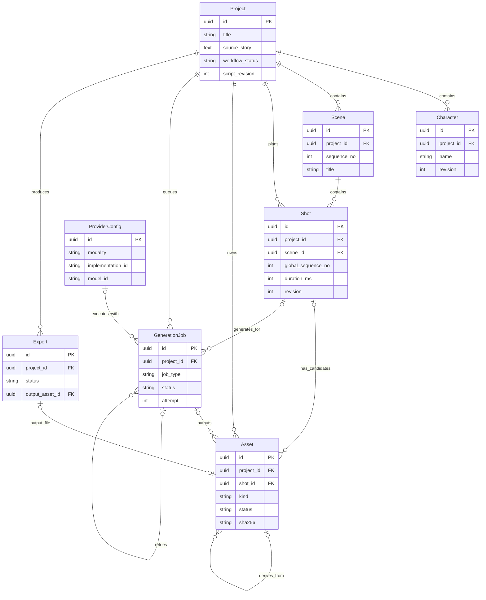

# 数据模型设计

## 1. 设计原则

- SQLite 是业务状态的权威来源，`data/` 是二进制素材来源；二者通过 Asset 记录和 SHA-256 对齐。
- 审核后的 Character、Scene、Shot 是当前剧本的权威数据。模型原始 JSON 保存在 GenerationJob 结果快照中，不再维护第二份可编辑的权威 `script_json`。
- 生成资产不可就地覆盖。重新生成创建新 Asset，Shot 只保存当前选择指针。
- Job 失败属于 Job，不把 Project 简单标记为 `FAILED`，以免覆盖已有有效产物。
- 所有主键使用 UUID；所有时间使用 UTC 存储，API 层转换显示时区。
- 可枚举状态在数据库、API、前端和文档中使用同一组大写字符串。

### 1.1 首批迁移与目标模型分层

首批迁移只以七个核心实体为主：`Project`、`Character`、`Scene`、`Shot`、`Asset`、`GenerationJob`、`Export`。`ProviderConfig` 第一版使用受控配置文件或环境变量，不要求建表。

下文保留完整字段作为目标设计，但首批迁移只实现纵向链路实际读取和写入的字段。以下统一标为**增强字段/机制**，不得成为第一段 MP4 或首批迁移条件：`dependency_schema_version`、`dependency_fingerprint`、`dependency_snapshot_json`、`attempt_no/output_slot`、`staging_relative_path`、`run_id`、`priority/attempt/max_attempts/next_attempt_at`、`worker_id`、`lease_expires_at`、`heartbeat_at`、`progress/current_step`、`client_idempotency_key`、`request_fingerprint`、`provider_call_history_json`、`cancel_requested_at`，以及 Export 的完整失效竞争字段。

## 2. 实体关系总览



Shot 的三个 `selected_*_asset_id`、Character 的 `reference_asset_id` 都是指向 Asset 的可空外键。为保持图清晰未重复绘制这些关系；Shot 指针是“当前选择”的唯一权威来源，Asset 不再设置第二个 `selected` 布尔值。指针可以暂时保留到 READY 或 STALE 资产，以便界面解释旧选择；只有 READY 且依赖快照与当前输入一致的资产能够通过导出门禁。

ER 图展示目标关系；首批迁移不创建 ProviderConfig 表，也不要求 GenerationJob 自关联或全部增强字段。

## 3. Project

表示一次短片制作工作区。

| 字段 | 类型 | 约束与说明 |
|---|---|---|
| `id` | UUID | 主键 |
| `title` | string | 1—100 字符，用户展示名 |
| `source_story` | text | 原始短故事 |
| `language` | string | 第一版固定或默认 `zh-CN` |
| `target_duration_ms` | integer | 20000—40000；API 可收秒数，入库前规范化为整数毫秒 |
| `aspect_ratio` | string | 第一版固定 `16:9` |
| `workflow_status` | enum | ProjectStatus；由应用服务按已验证产物更新 |
| `script_schema_version` | string | 例如 `script.v1`，具体值在编码前冻结 |
| `script_revision` | integer | 初始 0，每次保存已审核剧本递增 |
| `created_at` / `updated_at` | datetime | UTC |
| `archived_at` | datetime nullable | MVP 不物理删除项目 |

`workflow_status` 表示最后一个仍有效的业务阶段。单次生成失败不改变它；编辑上游导致条件不再满足时，应用服务重新计算到适当阶段，并把受影响资产标为 `STALE`。`archived_at` 是项目生命周期的唯一归档标记，不占用制作阶段枚举。

## 4. Character

| 字段 | 类型 | 约束与说明 |
|---|---|---|
| `id` | UUID | 主键 |
| `project_id` | UUID FK | `Project.id`，必填 |
| `name` | string | 项目内非空；建议 `(project_id, name)` 唯一 |
| `description` | text | 性格、剧情作用 |
| `visual_prompt` | text | 稳定的英文标签或模型提示片段 |
| `negative_prompt` | text nullable | 不希望出现的特征 |
| `voice_profile` | JSON nullable | 只存非敏感 voice ID、语言、语速等，不存声音克隆原始隐私信息 |
| `reference_asset_id` | UUID FK nullable | 已确认参考图，必须属于同一 Project |
| `sort_order` | integer | 稳定展示顺序 |
| `revision` | integer | 角色编辑时递增 |
| `created_at` / `updated_at` | datetime | UTC |

## 5. Scene

| 字段 | 类型 | 约束与说明 |
|---|---|---|
| `id` | UUID | 主键 |
| `project_id` | UUID FK | 必填 |
| `sequence_no` | integer | 从 1 开始，`(project_id, sequence_no)` 唯一 |
| `title` | string | 场景名 |
| `location` | string | 地点 |
| `time_of_day` | string nullable | 雨夜、黎明等，可先用受控字符串而非复杂枚举 |
| `mood` | string nullable | 氛围 |
| `description` | text | 背景、光照、色彩和固定元素 |
| `revision` | integer | 场景编辑时递增 |
| `created_at` / `updated_at` | datetime | UTC |

## 6. Shot

| 字段 | 类型 | 约束与说明 |
|---|---|---|
| `id` | UUID | 主键 |
| `project_id` | UUID FK | 冗余持有便于归属校验；必须与 Scene 的 Project 一致 |
| `scene_id` | UUID FK | 必填 |
| `global_sequence_no` | integer | 项目内 1—5，`(project_id, global_sequence_no)` 唯一 |
| `scene_sequence_no` | integer | 场景内顺序 |
| `duration_ms` | integer | 大于 0；审核时所有 Shot 之和必须等于 Project.target_duration_ms |
| `shot_type` | string | 近景、全景等；第一版可用受控词表 |
| `camera_motion` | enum/string | `STATIC`、`PUSH_IN`、`PULL_OUT`、`PAN_LEFT`、`PAN_RIGHT` 等 |
| `action` | text | 人物与道具动作 |
| `visual_prompt` | text | 最终画面描述的业务输入 |
| `negative_prompt` | text nullable | 负面描述 |
| `narration_text` | text nullable | 旁白 |
| `dialogue_text` | text nullable | 台词；MVP 不做口型 |
| `subtitle_text` | text nullable | 允许人工覆盖字幕，默认由旁白/台词导出 |
| `selected_keyframe_asset_id` | UUID FK nullable | 唯一当前关键帧选择；须为同 Shot 的 READY/STALE IMAGE；导出只接受兼容的 READY |
| `selected_clip_asset_id` | UUID FK nullable | 唯一当前片段选择；须为同 Shot 的 READY/STALE VIDEO；导出只接受兼容的 READY |
| `selected_audio_asset_id` | UUID FK nullable | 当前音频；可暂留 READY/STALE；Mock 音轨也须先由 Speech Job 生成和选择 |
| `workflow_status` | enum | ShotStatus |
| `revision` | integer | 镜头编辑时递增 |
| `created_at` / `updated_at` | datetime | UTC |

SQLite 不能用简单 CHECK 完成“所选 Asset 属于同 Project/Shot 且 kind 正确”的跨表约束，必须由应用服务验证，并以集成测试覆盖。

## 7. Asset

表示任何可归档文件，包括图片、音频、视频、字幕、manifest 或其他导出。

首批必需字段为：`id`、`project_id`、`shot_id`、`generation_job_id`、`parent_asset_id`、`kind`、`role`、`status`、`source_type`、`relative_path`、`mime_type`、`sha256`、`byte_size`、必要媒体信息、`metadata_json`、`created_at`。表中 attempt/output slot、STAGING 路径、source revision 和 dependency 三件套均为增强字段。

| 字段 | 类型 | 约束与说明 |
|---|---|---|
| `id` | UUID | 主键 |
| `project_id` | UUID FK | 必填 |
| `shot_id` | UUID FK nullable | 项目级导出可为空 |
| `generation_job_id` | UUID FK nullable | 用户上传资产可为空 |
| `attempt_no` | integer nullable | 产出它的 Worker attempt；用户上传可为空 |
| `output_slot` | string nullable | Job attempt 内输出槽位，如 `candidate:0`；与 generation_job_id/attempt_no 组成唯一约束 |
| `parent_asset_id` | UUID FK nullable | 派生来源，例如关键帧到运镜片段 |
| `kind` | enum | `IMAGE`、`AUDIO`、`VIDEO`、`SUBTITLE`、`MANIFEST` |
| `role` | string | `KEYFRAME_CANDIDATE`、`SHOT_CLIP`、`NARRATION`、`FINAL_EXPORT` 等 |
| `status` | enum | AssetStatus |
| `source_type` | enum | AssetSourceType |
| `relative_path` | string | 最终目标相对 `data/`；唯一，禁止绝对路径 |
| `staging_relative_path` | string nullable | STAGING 期间的 `.part` 相对路径；READY 后清空 |
| `mime_type` | string | 经文件探测确认，不只相信扩展名 |
| `sha256` | string | 64 位小写十六进制；READY 时必填 |
| `byte_size` | integer | 非负 |
| `width` / `height` | integer nullable | 图像或视频 |
| `duration_ms` | integer nullable | 音频或视频，来自探测；原始小数值保留在 metadata_json |
| `fps` | decimal nullable | 视频 |
| `source_shot_revision` | integer nullable | 仅用于审计的 Shot revision；项目级资产可为空，不能单独作为有效性门禁 |
| `dependency_schema_version` | string | role 对应的依赖选择规则版本 |
| `dependency_fingerprint` | string | 只对该 role 真正消费的规范化业务字段和输入 Asset ID/SHA-256 计算 SHA-256 |
| `dependency_snapshot_json` | JSON | 上述有效性输入的不可变明细；其他 revision 可作审计上下文，但不进入该 role 指纹 |
| `metadata_json` | JSON | 非敏感探测结果、warnings、来源摘要 |
| `created_at` | datetime | UTC |

`STALE` 不等于文件损坏：它表示文件仍可审计和预览，但不再自动满足当前 revision 的导出门禁。MVP 不提供物理删除；以后删除时必须先解除引用并采用可恢复策略。

## 8. GenerationJob

首批必需字段为：`id`、`project_id`、`shot_id`、`job_type`、`status`、`executor_kind`、执行器/Provider/模型必要快照、`timeout_seconds`、`retry_of_job_id`、`request_json`、`result_json`、单次 `error_json` 或错误摘要，以及创建/开始/结束时间。JobStatus 首批只有四态；自动 attempt、租约/心跳、客户端幂等、依赖指纹和多次 Provider call 历史均为增强。

| 字段 | 类型 | 约束与说明 |
|---|---|---|
| `id` | UUID | 主键 |
| `project_id` | UUID FK | 必填 |
| `shot_id` | UUID FK nullable | 项目级剧本或导出 Job 可为空 |
| `run_id` | UUID | 串联一次用户操作产生的任务链 |
| `job_type` | enum | JobType |
| `status` | enum | JobStatus |
| `executor_kind` | enum | `PROVIDER` 或 `MEDIA_SERVICE` |
| `executor_id_snapshot` | string | Adapter/媒体服务实现标识，例如 `mock_image_v1` 或 `ffmpeg_exporter_v1` |
| `provider_config_id` | UUID FK nullable | Mock 也可有配置记录，或以快照为准 |
| `provider_id_snapshot` | string nullable | PROVIDER Job 最初请求的 Provider；MEDIA_SERVICE 为空 |
| `implementation_id_snapshot` | string nullable | PROVIDER Adapter 实现标识；媒体实现使用 executor_id_snapshot |
| `model_id_snapshot` | string nullable | PROVIDER Job 的 `mock-v1`、模型名或 `unknown`；MEDIA_SERVICE 为 null/N/A |
| `model_revision_snapshot` | string nullable | PROVIDER 无法取得时写 `unknown`；MEDIA_SERVICE 为 null/N/A |
| `priority` | integer | MVP 可统一 0，保留可预测排序 |
| `attempt` | integer | 已开始的 attempt 数，初始 0 |
| `max_attempts` | integer | 包含首次在内，默认建议 3 |
| `next_attempt_at` | datetime nullable | RETRY_WAIT 使用 |
| `worker_id` | string nullable | 当前领取者 |
| `lease_expires_at` / `heartbeat_at` | datetime nullable | 崩溃恢复 |
| `timeout_seconds` | integer | 按 Job 类型配置快照 |
| `progress` | integer | 0—100，同一 attempt 单调 |
| `current_step` | string nullable | 可读阶段，不用于业务判断 |
| `client_idempotency_key` | UUID/string | 一次用户操作的键；与 project_id 组成唯一约束，仅用于 HTTP 重发去重 |
| `request_fingerprint` | string | 规范化输入、revision、依赖、提示词版本、Provider 策略和参数的 SHA-256；不唯一 |
| `retry_of_job_id` | UUID FK nullable | 手动重试来源 |
| `request_json` | JSON | 输入、revision、提示词与参数快照，已脱敏 |
| `result_json` | JSON nullable | Provider 元数据、输出和验证摘要 |
| `error_history_json` | JSON | 每次错误码、时间和脱敏详情 |
| `provider_call_history_json` | JSON | 每次 call 的 attempt/call 序号、Provider/model、起止时间、结果、错误和 fallback 原因 |
| `cancel_requested_at` | datetime nullable | 协作取消 |
| `created_at` / `started_at` / `finished_at` | datetime nullable | UTC |

Job 与 Asset 是一对多：一个 Job 可以产生多个候选 Asset。P0 先采用临时文件校验、同卷原子替换、登记 READY Asset 的简化流程；登记失败时 Job 为 FAILED，文件不得被选择或导出。STAGING 两阶段协议与 `(generation_job_id, attempt_no, output_slot)` 恢复语义保留为增强目标。

## 9. ProviderConfig

本节是目标设计。第一版不创建 ProviderConfig 表：非敏感配置放受控配置文件，密钥只通过环境变量注入；每个 Job 仍保存其实际执行器、Provider、模型和非敏感参数快照。需要运行时管理多配置时再迁移本实体。

| 字段 | 类型 | 约束与说明 |
|---|---|---|
| `id` | UUID | 主键 |
| `name` | string | 用户可读名称 |
| `modality` | enum | `TEXT`、`IMAGE`、`VIDEO`、`TTS` |
| `implementation_id` | string | 代码注册表中的稳定键 |
| `model_id` | string | 模型或 Mock 标识 |
| `model_revision` | string nullable | 固定版本优先；未知时显式记录 |
| `enabled` | boolean | 是否可被 Router 选择 |
| `base_url` | string nullable | 受 allowlist 控制，默认本机回环 |
| `secret_env_var_name` | string nullable | 只保存环境变量名，不保存值 |
| `non_secret_settings_json` | JSON | 超时、默认参数、能力开关等非敏感信息 |
| `created_at` / `updated_at` | datetime | UTC |

健康状态是短期运行信息，不必频繁写 ProviderConfig；可以按请求计算或做短 TTL 内存缓存。Job 必须保存配置快照，避免事后修改配置篡改历史。

## 10. Export

首批必需字段为：`id`、`project_id`、`generation_job_id`、`version`、四态 `status`、输出/字幕/manifest Asset 外键、`duration_ms`、基础媒体设置、简单来源快照、FFmpeg/ffprobe 版本、验证结果和时间。`run_id`、完整 argv、`invalidated_at/invalidation_reason` 及复杂失效竞争是增强字段。

| 字段 | 类型 | 约束与说明 |
|---|---|---|
| `id` | UUID | 主键 |
| `project_id` | UUID FK | 必填 |
| `generation_job_id` | UUID FK | 对应 EXPORT Job，建议唯一 |
| `run_id` | UUID | 导出链路 |
| `version` | integer | 项目内递增，`(project_id, version)` 唯一 |
| `status` | enum | ExportStatus；Job 是执行调度权威 |
| `output_asset_id` | UUID FK nullable | 成功后指向 FINAL_EXPORT VIDEO |
| `subtitle_asset_id` | UUID FK nullable | 边车字幕 |
| `manifest_asset_id` | UUID FK nullable | 追溯清单 |
| `duration_ms` | integer nullable | ffprobe 实测并规范化为毫秒；原始值保留在 validation_json |
| `resolution` | string | 目标 `1280x720` |
| `fps` | decimal | 目标 24 |
| `settings_json` | JSON | 编码、音频、字幕和转场设置 |
| `source_snapshot_json` | JSON | Shot、Asset、revision 和哈希的不可变快照 |
| `ffmpeg_version` / `ffprobe_version` | string nullable | 实际命令输出摘要 |
| `sanitized_argv_json` | JSON | 参数数组脱敏后保存 |
| `validation_json` | JSON nullable | ffprobe 及业务校验结果 |
| `invalidated_at` | datetime nullable | 上游变更导致该历史导出不再代表当前项目时填写 |
| `invalidation_reason` | string nullable | 失效原因和受影响依赖摘要 |
| `created_at` / `finished_at` | datetime nullable | UTC |

P0 的 Export 与关联 Job 使用相同四态：创建为 QUEUED，执行为 RUNNING，只有输出 Asset READY 且 ffprobe 验证通过才为 SUCCEEDED，否则为 FAILED。上游修改后，P0 可简单阻止用户把旧导出当作当前版本并要求重新导出；`invalidated_at/invalidation_reason`、取消/重试过程映射和完整失效竞争语义在增强阶段实现。

ER 图只画了 output_file；`output_asset_id`、`subtitle_asset_id` 和 `manifest_asset_id` 在 QUEUED/失败/取消时都可以为空，成功时按业务规则必填相应 READY Asset。

## 11. 状态与类型枚举

### 11.1 ProjectStatus

```text
DRAFT
SCRIPT_READY
STORYBOARD_READY
MEDIA_READY
EXPORTED
```

- `DRAFT`：不存在通过 Schema 和业务校验的已审核剧本。
- `SCRIPT_READY`：存在 3—5 个合法 Shot，且 `sum(Shot.duration_ms) == Project.target_duration_ms`。
- `STORYBOARD_READY`：在 SCRIPT_READY 基础上，每个 Shot 都有依赖匹配的 READY 关键帧选择。
- `MEDIA_READY`：在 STORYBOARD_READY 基础上，每个 Shot 都有依赖匹配的 READY clip、READY audio 和非空有效字幕文本。
- `EXPORTED`：在 MEDIA_READY 基础上，至少存在一个未失效的 SUCCEEDED Export，其输出 Asset 为 READY 且 source snapshot 与当前项目匹配。

状态是应用服务从当前数据派生的最高阶段，前端不得直接写。项目归档只设置 `archived_at`；恢复显示时仍能知道归档前的制作阶段。

### 11.2 ShotStatus

```text
PLANNED
KEYFRAME_SELECTED
CLIP_READY
READY_FOR_EXPORT
```

- `PLANNED`：镜头业务字段合法，但没有当前有效关键帧选择。
- `KEYFRAME_SELECTED`：有依赖匹配的 READY 关键帧。
- `CLIP_READY`：在上一条件基础上，有依赖匹配的 READY clip。
- `READY_FOR_EXPORT`：在上一条件基础上，有依赖匹配的 READY audio 和合法字幕文本。

ShotStatus 同样由应用服务重算，不由 Job 成败或前端直接覆盖。

### 11.3 AssetStatus

```text
READY
STALE
INVALID
```

P0 只持久化已验证的 READY、已过期的 STALE 和无效的 INVALID。`STAGING`、`DELETED` 以及相应崩溃恢复是增强枚举；增强后的合法流转再加入 `STAGING -> READY/INVALID`。

### 11.4 JobStatus

```text
QUEUED
RUNNING
SUCCEEDED
FAILED
```

这是第一版唯一必须实现的 JobStatus 集合。稳定后可增加 `RETRY_WAIT`、`CANCEL_REQUESTED`、`CANCELLED`，但迁移和状态机必须成套增加，不能只加 UI 标签。

### 11.5 JobType

```text
GENERATE_SCRIPT
GENERATE_KEYFRAME
GENERATE_CLIP
SYNTHESIZE_SPEECH
EXPORT_VIDEO
```

### 11.6 ExportStatus

```text
QUEUED
RUNNING
SUCCEEDED
FAILED
```

P0 的 Export 与 Job 均为四态。增强取消时可增加 CANCELLED；未来的 `invalidated_at` 与执行状态正交，不增加名为 STALE 的 Export 状态。

### 11.7 ExecutorKind

```text
PROVIDER
MEDIA_SERVICE
```

文本、图像、视频生成和 TTS Job 使用 PROVIDER；EXPORT_VIDEO 使用 MEDIA_SERVICE。FFmpegMotion 仍是 VideoProvider，因此其 GENERATE_CLIP Job 使用 PROVIDER，并标记 `DETERMINISTIC_FALLBACK`。

### 11.8 AssetSourceType

```text
MOCK
DETERMINISTIC_FALLBACK
LOCAL_MODEL
REMOTE_API
USER_UPLOAD
DEMO_FIXTURE
SYSTEM_DERIVED
```

`DETERMINISTIC_FALLBACK` 只用于 FFmpeg 静帧运镜片段；系统生成的字幕、manifest 和最终合成视频使用 `SYSTEM_DERIVED`，其混合上游来源在依赖快照/manifest 中展开。获授权的固定演示旁白使用 `DEMO_FIXTURE`，不能算作 TTS Provider 成功。

### 11.9 合法 Job 流转

| 当前 | 可到达 |
|---|---|
| `QUEUED` | `RUNNING` |
| `RUNNING` | `SUCCEEDED`、`FAILED` |
| `SUCCEEDED` / `FAILED` | 无；从 FAILED 手动重试时创建新 QUEUED Job |

## 12. 约束、索引与事务建议

- 开启 `PRAGMA foreign_keys=ON`、WAL 和合理 `busy_timeout`；值由下一阶段并发测试确定。
- P0 唯一索引：Scene `(project_id, sequence_no)`、Shot `(project_id, global_sequence_no)`、Export `(project_id, version)`、Asset `relative_path`。
- 增强唯一索引：Job `(project_id, client_idempotency_key)`、Asset `(generation_job_id, attempt_no, output_slot)`；增强调度索引再加入 `next_attempt_at`、`priority`、`lease_expires_at`。
- 查询索引：Asset `(project_id, shot_id, kind, status)`、Job `(project_id, created_at)`。
- P0 CHECK：目标时长 20000—40000 ms、Shot 时长大于 0、byte_size 非负；progress、attempt 和 output slot 相关约束随增强字段一起迁移。
- 跨行规则由应用服务在事务中校验：3—5 个镜头、`sum(Shot.duration_ms) == Project.target_duration_ms`、外键归属、所选 Asset 类型/状态/依赖一致性。
- 模型调用、网络请求和 FFmpeg 期间绝不持有数据库事务。
- SQLite 迁移使用受控迁移工具；不在生产式启动时随意 `create_all` 改表。

## 13. 上游修改与失效传播（目标设计）

P0 先实现简单且保守的规则：上游数据变化后清除受影响的当前选择或标记相关 Asset 为 STALE，并拒绝继续使用旧选择导出。下面的按 role dependency fingerprint、并发 Job 取消与 Export 精细失效是目标设计，留到工程保底之后。

| 修改对象 | revision 变化 | 下游处置 |
|---|---|---|
| 原始故事并重新确认剧本 | `Project.script_revision + 1` | 全部派生 Asset 标 STALE；已有 Export 写失效时间/原因 |
| Character 视觉描述/参考图 | Character 与受影响 Shot revision | 相关关键帧、片段标 STALE；已有 Export 写失效时间/原因 |
| Character voice profile | Character 与受影响 Shot revision | 相关音频标 STALE；已有 Export 写失效时间/原因 |
| Scene 背景 | Scene 与相关 Shot revision | 场景内关键帧、片段标 STALE；已有 Export 写失效时间/原因 |
| Shot 画面或动作 | `Shot.revision + 1` | 本镜头关键帧和依赖它的片段标 STALE；已有 Export 写失效时间/原因 |
| Shot 时长或运镜 | `Shot.revision + 1` | 本镜头片段、音频时长约束和字幕标 STALE；已有 Export 写失效时间/原因，关键帧保持有效 |
| Shot 旁白或台词 | `Shot.revision + 1` | 本镜头音频和字幕标 STALE；已有 Export 写失效时间/原因 |
| 只更换所选关键帧 | 不必改 Shot 文本 revision，但记录选择事件 | 依赖旧关键帧的片段标 STALE；已有 Export 写失效时间/原因 |
| 只更换所选片段或音频 | 不必改 Shot 文本 revision，但记录选择事件 | 已有 Export 写失效时间/原因 |
| 只修改字幕 | Shot revision | 字幕 Asset 标 STALE、已有 Export 写失效时间/原因；无关关键帧可继续有效 |
| 镜头重排 | Project.script_revision 或专用顺序 revision | 项目字幕时间线与已有 Export 失效；镜头内部素材保持有效 |

应用服务按 `dependency_schema_version` 为不同 Asset role 选择真正消费的输入，重新计算 `dependency_fingerprint`，而不是拿单一 Shot/script revision 判断所有素材：

| Asset role | 进入有效性指纹的最小输入 |
|---|---|
| `KEYFRAME_CANDIDATE` | Character 视觉字段/参考图哈希、Scene 视觉字段、Shot 画面/动作/负面描述 |
| `SHOT_CLIP` | 所选关键帧 ID/SHA-256、Shot 运镜和 duration_ms、目标媒体规格 |
| `NARRATION` | 旁白/台词、语言、voice profile、duration_ms |
| `SUBTITLE` | 已审核 subtitle_text、duration_ms、镜头顺序/时间线 |
| `FINAL_EXPORT` / `MANIFEST` | 有序 Shot、所选 clip/audio ID/SHA-256、字幕时间线和导出设置 |

选择指针可继续指向 STALE 资产供预览，但导出门禁要求每个所选 Asset 为 READY，且按其 role 从当前数据重算的 fingerprint 与存档值一致。提示词、Provider、seed 和完整 revision 仍全部保存在 Job/Asset 快照用于追溯，但未被该 role 实际消费的字段不会误触发失效。MVP 不提供绕过门禁的“人工重新确认”。

增强阶段再实现上游保存与运行中 Job 的复杂竞争：受影响的队列任务取消、运行任务协作取消、依赖指纹 CAS、STAGING 失效和成功/编辑两种提交顺序。P0 不以这些并发语义作为首段成片或验收条件。

## 14. 追溯数据最小集

P0 从任一最终 MP4 至少能够反查：Export → 有序 Shot 与所选视频/音频/字幕 Asset → GenerationJob executor。PROVIDER Job 继续追到 Provider/模型、提示词和参数；MEDIA_SERVICE Job 追到 FFmpeg/ffprobe 版本和命令摘要；Asset 保留 SHA-256。dependency fingerprint、Provider 多次调用历史和完整双向使用关系在增强阶段补齐。

这种关系是平台“模型集成”能力的核心证据，也为真实模型替换、失败复盘和结果对比提供基础。
