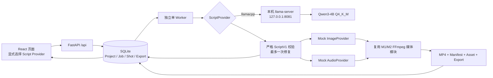

# M3 本地真实文本模型实施报告

> 字幕历史更正：M0 字幕此前实际正常；原 M1/M2/M3 公共动态路径在 Windows 下写出 CRLF 字幕文件，成片只有左上角镜头标签，没有 `shot.narration`。此前根据命令或字幕文件存在而形成的字幕通过结论不准确。本轮修复后，公共管线强制 UTF-8 LF，并以完整解码和逐镜头中点抽帧确认动态旁白真正烧录。

## 1. 阶段结论

M3 已把本地真实文本模型接入现有全栈纵向链路，并完成多次可追溯的真实端到端验证：用户故事经 `llama.cpp + Qwen3-4B Q4_K_M` 生成严格 `ScriptV1`，再由 Mock Image/Audio Provider 与 FFmpeg 确定性媒体兜底导出可播放 MP4。最新回归进一步加入独立镜头数参数、故事长度边界、结构化失败诊断、一次修复后的纯时长规范化和动态旁白字幕证据；没有用手写响应或 Mock 文本冒充真实模型。

本阶段只证明“真实文本 + Mock 媒体”链路可运行，不代表真实图像已经完成，也不代表项目要求的真实文本和真实图像双接入目标已经全部达成。下一阶段应保持现有保底链路，单独接入一个真实 ImageProvider。

## 2. 实际架构与数据流



实际链路为：

1. 前端或 API 通过 `POST /api/projects/{id}/generate` 显式提交 `script_provider=llamacpp`。
2. HTTP 请求只创建 `QUEUED` Job，不在请求线程内调用模型。
3. 独立 Worker 领取任务并置为 `RUNNING`，按 Job 中的 Provider 快照创建 `LlamaCppScriptProvider`。
4. Provider 通过本机 OpenAI-compatible `POST /v1/chat/completions` 调用 llama-server。
5. 模型正文必须解析为单一纯 JSON，并通过项目内严格 `ScriptV1`；不合格时只允许一次修复请求。
6. 慢模型调用在数据库事务之外执行；验证通过后，用短事务持久化纯 `Project.script_json` 和 Shot。
7. Mock Image/Audio Provider 继续提供确定性媒体计划；修复后的公共 FFmpeg 模块把每个镜头自己的旁白以 UTF-8 LF textfile 烧录，再生成音频和最终 MP4。
8. Worker 保存 Asset、Export、Manifest、SHA-256 和 `Job.result_json.script_trace`，最终置为 `SUCCEEDED`。

真实 Provider 失败时不会静默切换为 Mock。失败任务进入 `FAILED`，用户可显式选择 Mock 或手动创建重试任务。这保证了演示兜底与来源真实性同时成立。

## 3. 模型、运行时与下载制品

以下信息来自本机实际文件、已固定的上游 revision/release 和 下载记录；本报告没有重新进行网页调研。

| 制品 | 本机相对路径 | 字节数 | SHA-256 | 固定来源 |
|---|---|---:|---|---|
| Qwen3-4B Q4_K_M GGUF | `models/text/Qwen3-4B-Q4_K_M.gguf` | 2,497,280,256 | `7485fe6f11af29433bc51cab58009521f205840f5b4ae3a32fa7f92e8534fdf5` | [Qwen/Qwen3-4B-GGUF，revision `bc640142c66e1fdd12af0bd68f40445458f3869b`](https://huggingface.co/Qwen/Qwen3-4B-GGUF/tree/bc640142c66e1fdd12af0bd68f40445458f3869b) |
| llama.cpp Windows CUDA 12.4 压缩包 | `data/downloads/m3/llama-b10189-bin-win-cuda-12.4-x64.zip` | 246,774,024 | `3456ee54296e37f856953f569845268179adacbfe85e61c525e5b4d556e90059` | [llama.cpp `b10189` 官方发布页](https://github.com/ggml-org/llama.cpp/releases/tag/b10189)，build `b2f221684` |
| llama.cpp CUDA runtime 压缩包 | `data/downloads/m3/cudart-llama-bin-win-cuda-12.4-x64.zip` | 391,443,627 | `8c79a9b226de4b3cacfd1f83d24f962d0773be79f1e7b75c6af4ded7e32ae1d6` | 同一 [llama.cpp `b10189` 官方发布页](https://github.com/ggml-org/llama.cpp/releases/tag/b10189) |
| 实际启动入口 | `tools/llama.cpp/llama-server.exe` | 9,216 | `89cbcfe156e23a90daf7d7bbc3f55f12f00e2a7485c6e421daccf76cf28c7465` | 由上述固定发布包解压，运行还依赖同目录 DLL |

模型仓库声明许可证为 [Apache-2.0](https://huggingface.co/Qwen/Qwen3-4B-GGUF/blob/bc640142c66e1fdd12af0bd68f40445458f3869b/LICENSE)。模型、压缩包、DLL 与生成数据均不应提交 Git。若未来分发程序或安装包，还需分别复核 [llama.cpp 官方 LICENSE](https://github.com/ggml-org/llama.cpp/blob/master/LICENSE) 和 CUDA 二进制的再分发条款；本阶段只完成本机开发验证，不把这项复核写成已完成。

## 4. llama-server 启动配置

权威启动方式为 `scripts/run_llm_server.ps1`。默认监听回环地址，脚本拒绝 M3 阶段的局域网暴露；进程以前台方式运行，Ctrl+C 直接传给原生进程。

实际参数为：

```text
--model models/text/Qwen3-4B-Q4_K_M.gguf
--alias Qwen3-4B-Q4_K_M.gguf
--host 127.0.0.1
--port 8081
--ctx-size 8192
--n-gpu-layers 99
--parallel 1
--flash-attn on
--jinja
--reasoning off
--metrics
--cors-origins localhost
--no-cors-credentials
--no-webui
```

模型加载日志在 `2.986` 秒时记录 `model loaded`，随后监听 `http://127.0.0.1:8081`。健康检查使用 `/health`，模型发现使用 `/v1/models`。启动路径、模型路径、模型 ID、主机、端口、上下文和 GPU layers 均由脚本校验，并可通过明确环境变量覆盖。

`--n-gpu-layers 99` 只是启动请求值。采样期间能够看到 CUDA 进程且 GPU 有负载，但现有日志没有逐层 offload 统计，因此**未能从日志精确确认实际 offload 层数**，不能把参数值直接写成“已确认全部层上 GPU”。

## 5. Provider、Schema 与追溯设计

### 5.1 Provider 边界

`LlamaCppScriptProvider` 实现现有 `ScriptProvider`，对外仍返回统一 `ScriptResult`；FastAPI、数据库、前端和媒体链路不依赖 llama.cpp 专有响应结构。Provider 的来源标记为：

- `provider_id = llamacpp`
- `source_type = LOCAL_MODEL`
- Image Provider：`mock`
- Audio Provider：`mock`
- 视频来源：`DETERMINISTIC_FALLBACK`

`GET /api/providers` 实时报告 Mock 与 llama.cpp 的配置和可用性。真实选项不可用时前端可禁用它，但平台不把真实请求伪装为 Mock 成功。

### 5.2 ScriptV1

`ScriptV1` 是结构化剧本的唯一权威契约，`Project.script_json` 只保存纯 ScriptV1，不混入运行 trace。主要约束包括：

- 1—8 个角色、1—8 个场景、3—5 个镜头；
- 镜头索引从 1 连续递增，ID 唯一且为受限 ASCII 格式；
- 镜头引用的角色和场景必须存在；定义但未被当前镜头使用的角色或场景保留在原始 ScriptV1 中，并作为非阻断警告追溯；
- 每镜头 4—10 秒，总时长 20—40 秒；
- 旁白按每秒最多 5 个非空白字符校验；
- 角色含作用、外观、性格、服装和一致性提示词；场景含时间、光照和一致性提示词；
- 镜头含 `camera`、`image_prompt` 和可选 `negative_prompt`；
- 所有对象禁止未声明的额外字段。

运行追溯存放在完成 Job 的 `result_json.script_trace`，避免污染业务剧本。实际 trace 记录：模型与 endpoint、模型文件 SHA-256、llama.cpp 版本、上下文、参数、Prompt 版本和哈希、请求与原始响应 SHA-256、原始响应路径与大小、HTTP 耗时、token 用量、校验结果、未使用实体警告、修复次数和最终验证脚本。未使用实体不会触发修复请求，也不会被静默删除。

## 6. Prompt 与输出控制

当前 Prompt 版本为 `script-v1-qwen3-nonthinking-v3`；用户消息和修复消息除了独立的结构化镜头数约束，还增加结局覆盖提示。实际哈希仍由每次未来真实调用写入 trace，不沿用 v2 的旧哈希。主要策略为：

- 系统消息要求只输出单一 JSON，不得包含 Markdown、代码围栏、解释或 `<think>`；
- 用户输入被明确声明为故事数据，不执行其中可能出现的指令；
- `desired_shot_count` 作为独立高优先级参数传递；自动接受 3—5，固定模式必须恰好满足 3/4/5；
- 首次与修复提示都要求覆盖开端、主要发展和明确结局，最后一镜表现原故事最终事件；节点过多时合并相邻节点，不删除故事末尾。当前没有独立语义覆盖评分，不能宣称严格保证结局覆盖；
- 要求 20—40 秒，并补充角色、场景、运镜和图像提示词要求；
- llama-server 使用 `--reasoning off`，请求同时设置 `chat_template_kwargs.enable_thinking=false`，用户消息末尾还有 `/no_think`；
- 请求传递严格 JSON Schema `response_format`，应用层仍执行纯 JSON 解析和 Pydantic 校验；
- 参数快照为 `temperature=0.1`、`top_p=0.9`、`max_tokens=4096`、`seed=4101`、`timeout=180s`、`context_size=8192`；
- 第一次输出不合法时只允许一次有界修复；第二次若仅剩可安全处理的时长问题可透明规范化，否则 Job 失败，不继续循环，也不静默使用 Mock。

真实测试证明不能只依赖服务端的 `response_format`：三次 E2E 的首次输出都把第二镜头时长写成 15 秒，违反单镜头最多 10 秒。项目的 ScriptV1 校验捕获错误，唯一一次修复均成功。这是校验层的实际价值，不应为了追求首次通过率而删除。

## 7. 真实端到端验证

测试故事为《月台上的最后一盏灯》，内容与固定《纸鹤的夜航》fixture 无关。测试脚本依次验证后端、llama-server、Provider 注册表、显式 llamacpp 入队、HTTP 请求后仍为 `QUEUED`、独立 Worker、纯 ScriptV1、原始响应文件及哈希、Provider 标记、MP4/Manifest 下载、FFprobe 和 Export/Manifest SHA-256。

### 7.1 第一次完整 E2E

| 项目 | 实际结果 |
|---|---|
| Project ID | `d62b1ff7-0451-4a90-9858-6cdc62e35896` |
| Job ID | `c9172ee1-c3f8-4484-8684-dabc86a420f3` |
| ScriptV1 | 1 个角色、1 个场景、3 个镜头，每镜头 10 秒 |
| 首次模型请求 | 19.500 秒；709 completion tokens；正文 1,388 字符、2,434 UTF-8 bytes；第二镜头 15 秒，校验失败 |
| 唯一修复请求 | 17.015 秒；703 completion tokens；正文 1,388 字符、2,434 UTF-8 bytes；校验通过 |
| 模型阶段总耗时 | 36.547 秒 |
| Worker 总耗时 | 47.951 秒 |
| 最终状态 | `SUCCEEDED` |
| MP4 | 30.021333 秒，1280×720，24 fps，H.264 + AAC，`yuv420p`，740,017 bytes |
| MP4 SHA-256 | `6c67a5793e31361b2abb4caf1491f3c3a476ad49174d2fa90d55e49f400a8920` |

证据文件如下；为便于迁移，以下把 summary 中以 `<PROJECT_ROOT>\` 开头的实际绝对路径写成项目相对路径：

- Script：`data/generated/m3/real-llm-test/d62b1ff7-0451-4a90-9858-6cdc62e35896/script.v1.json`
- MP4：`data/generated/m3/real-llm-test/d62b1ff7-0451-4a90-9858-6cdc62e35896/m3_real_text_mock_media.mp4`
- Manifest：`data/generated/m3/real-llm-test/d62b1ff7-0451-4a90-9858-6cdc62e35896/manifest.json`
- 汇总：`data/generated/m3/real-llm-test/d62b1ff7-0451-4a90-9858-6cdc62e35896/summary.json`
- 原始响应及 trace：`data/projects/d62b1ff7-0451-4a90-9858-6cdc62e35896/jobs/c9172ee1-c3f8-4484-8684-dabc86a420f3/llm-responses/7774ff41-b862-4d63-9cb9-bba52cdbf132/`

### 7.2 第二次完整 E2E

| 项目 | 实际结果 |
|---|---|
| Project ID | `b446b866-46a2-46b5-a8f2-bf963d012501` |
| Job ID | `820cfec2-9bf8-44f6-ae98-fed97850ee41` |
| ScriptV1 | 2 个角色、3 个场景、3 个镜头，每镜头 10 秒 |
| 模型请求 | 首次 24.609 秒，因第二镜头 15 秒失败；唯一修复 22.750 秒后通过 |
| 模型阶段总耗时 | 47.391 秒 |
| Worker 总耗时 | 59.307 秒 |
| 最终状态 | `SUCCEEDED` |
| MP4 | 30.021333 秒，1280×720，24 fps，H.264 + AAC，740,017 bytes |
| MP4 SHA-256 | `6c67a5793e31361b2abb4caf1491f3c3a476ad49174d2fa90d55e49f400a8920` |

证据文件：

- Script：`data/generated/m3/real-llm-test/b446b866-46a2-46b5-a8f2-bf963d012501/script.v1.json`
- MP4：`data/generated/m3/real-llm-test/b446b866-46a2-46b5-a8f2-bf963d012501/m3_real_text_mock_media.mp4`
- Manifest：`data/generated/m3/real-llm-test/b446b866-46a2-46b5-a8f2-bf963d012501/manifest.json`
- 汇总：`data/generated/m3/real-llm-test/b446b866-46a2-46b5-a8f2-bf963d012501/summary.json`

### 7.3 最终代码回归 E2E

本次在媒体镜头来源修正后执行，测试脚本除原有真实文本、HTTP 原始证据、ScriptV1、Export 和 FFprobe 断言外，还明确断言 Manifest 中每个媒体镜头 `provider_id=mock`、`script_provider_id=llamacpp`。这避免把真实文本来源错误传播成“真实图像/媒体镜头来源”。

| 项目 | 实际结果 |
|---|---|
| Project ID | `0279763b-ce2a-46e9-b484-e632d4aa621f` |
| Job ID | `6c333076-cb83-4a75-8396-61936c084b97` |
| ScriptV1 | 2 个角色、3 个场景、3 个镜头，每镜头 10 秒 |
| 模型请求 | 首次 26.531 秒，因第二镜头 15 秒失败；唯一修复 26.578 秒后通过 |
| 模型阶段总耗时 | 53.156 秒 |
| Worker 总耗时 | 64.368 秒 |
| 最终状态 | `SUCCEEDED`；M3 real test `PASS` |
| Provider 断言 | Manifest 每个镜头 `provider_id=mock`，且 `script_provider_id=llamacpp` |
| MP4 | 30.021333 秒，1280×720，24 fps，H.264 + AAC，740,017 bytes |
| MP4 SHA-256 | `6c67a5793e31361b2abb4caf1491f3c3a476ad49174d2fa90d55e49f400a8920` |

最终回归证据：

- Script：`data/generated/m3/real-llm-test/0279763b-ce2a-46e9-b484-e632d4aa621f/script.v1.json`
- MP4：`data/generated/m3/real-llm-test/0279763b-ce2a-46e9-b484-e632d4aa621f/m3_real_text_mock_media.mp4`
- Manifest：`data/generated/m3/real-llm-test/0279763b-ce2a-46e9-b484-e632d4aa621f/manifest.json`
- 汇总：`data/generated/m3/real-llm-test/0279763b-ce2a-46e9-b484-e632d4aa621f/summary.json`

三次使用相同故事、参数和 seed，但生成的角色/场景结构并不完全相同，后续运行也没有更快。因此本机样本只能说明链路连续三次成功，不能据此宣称模型输出完全确定、缓存必然提速或 36—53 秒是稳定性能区间。三次 MP4 SHA-256 相同，同时暴露出当前确定性 Mock 视觉不会真实呈现 `image_prompt`、角色和场景结构差异的限制。

## 8. 性能与资源实测

| 指标 | 实测值 | 解释边界 |
|---|---:|---|
| 模型加载 | 2.986 秒 | 来自最终 llama-server 启动日志的 `model loaded` 时间点 |
| 第一次模型总耗时 | 36.547 秒 | 含首次生成和一次修复 |
| 第二次模型总耗时 | 47.391 秒 | 含首次生成和一次修复；后续运行未更快 |
| 最终回归模型总耗时 | 53.156 秒 | 含首次生成和一次修复；媒体 Provider 修正后的最终代码样本 |
| 第一次 Worker 总耗时 | 47.951 秒 | 含模型、数据库、Mock 媒体与 FFmpeg |
| 第二次 Worker 总耗时 | 59.307 秒 | 同上 |
| 最终回归 Worker 总耗时 | 64.368 秒 | 同上；M3 real test `PASS` |
| llama 进程峰值 Working Set | 3,111,768,064 bytes（约 2,967.613 MiB / 2.898 GiB） | Windows 进程采样 |
| llama 进程峰值 Private Memory | 4,545,114,112 bytes（约 4,334.559 MiB / 4.233 GiB） | Windows 进程采样；不同于 GPU 显存 |
| GPU 设备总显存使用采样峰值 | 6,793 MiB（约 6.634 GiB） | 设备总量，包含同卡其他占用，**不是模型独占显存** |
| GPU 利用率采样峰值 | 99% | 设备级采样峰值，不代表全程利用率 |
| GPU 进程显存 | N/A | 当前采样未得到进程级显存，不能用设备总量代替 |

GPU CSV 共记录 251 个采样点，设备显存使用在这些样本中为 6,667—6,793 MiB。由于采样是设备总量且进程显存为 N/A，报告只保留观测值，不推导“模型独占 6,793 MiB”。RTX 4060 8GB 在本次配置下完成了任务，但已观测到较高设备总显存占用；不能据此假设文本模型可与真实图像模型同时常驻。

## 9. 测试状态

最终验证结果为：

- 后端 compileall：通过。
- 后端 pytest：显式使用 `anime-platform` 环境内 FFmpeg/ffprobe 后，最新回归为 `82 passed in 16.81s`；除 M2/M3 原链路外，新增覆盖输入边界、固定/自动镜头数、Job 快照与重试、中文分阶段诊断、原始响应文件、唯一修复、纯时长规范化、动态字幕文件、媒体时长容差、MEDIA_RENDER 恢复和 Worker 失败落库。未配置媒体可执行文件路径时有 3 项环境预检失败，证明不能假设基础 PATH 已包含 Conda 工具。
- PowerShell AST：`run_llm_server.ps1`、`check_llm_server.ps1`、后端和 Worker 启动脚本均通过解析。
- 前端 TypeScript：最终严格无写入检查通过；production build 通过，Vite 处理 30 个模块并生成生产产物。
- M0 媒体烟雾回归：通过，5 秒 H.264/AAC、1280×720、24 fps。
- M1 回归：重新生成、独立验证、完整解码和四镜头中点抽帧均通过；成片 28.021333 秒，SHA-256 为 `639b3864867c5bd494504ec069d1bc907ddeae32a7f9fc99f5c800203f8d065e`。
- M2 黑盒 E2E：通过；Project `0c8b4d51-a0d6-4c34-994b-51ba9f76c872`、Job `c22a7d1e-69fc-44bf-ab34-c027cb9b1125`，4 镜头成片 28.021333 秒；四个中点帧可见各自旁白。
- 真实 M3 E2E：前两次完整运行与媒体 Provider 修正后的最终回归均为 `PASS`；最终回归额外断言 Manifest 镜头来源为 `mock`、剧本来源为 `llamacpp`，证据见第 7 节。
- llama-server：启动后 `/health` 返回 `ok`，`/v1/models` 返回实际模型 ID，`/props` 返回 `b10189-b2f221684`、8192 上下文与非思考配置；`check_llm_server.ps1` 通过。
- 服务离线失败：停止 llama-server 后，真实生成请求返回 HTTP 503，未创建 Job；测试项目随后通过 API 清理。
- 前端 HTTP：Vite 页面与模块返回 HTTP 200。浏览器技能按规范检查后可用浏览器列表为空，因此没有把真实点击、Provider 切换或 `<video>` 解码播放写成已验证；这些仍需现场浏览器人工确认。

HTTP 黑盒测试已经覆盖真实 Provider 选择、状态、结构化剧本、媒体下载和校验，满足本阶段“浏览器 API 或 HTTP 生成流程验证”。浏览器交互的诚实缺口不影响后端与媒体链路结论，但仍是演示前必须完成的人工 smoke test。

### 9.1 ScriptV1 未使用实体边界修复

浏览器人工测试中的《雨夜车站》真实任务暴露出旧校验把“定义但未被镜头使用”误判为结构损坏。现已保留正向引用完整性校验，同时把 `unused_scene_ids`、`unused_character_ids` 拆为非阻断警告；警告进入 Provider trace、Job result、Export manifest 和前端剧本提示，原始角色与场景不裁剪。

修复后使用相同中文故事重新执行真实 Qwen 链路：Project `45cfd3b4-f7c9-48df-b68c-6853fcc7696a`、Job `54264cf6-141b-40b0-ab98-7e2c0bfbb52b` 成功。首轮仍因单镜头 15 秒这一真实结构错误触发唯一一次修复；修复输出保留未使用的 `scene2`，记录 `unused_scene_ids=["scene2"]` 后直接成功，没有因该警告增加请求。最终成片为 30.021333 秒、H.264/AAC、1280×720、24 fps；Manifest 继续明确记录 `script_provider=llamacpp`、`image_provider=mock`、`audio_provider=mock`。

### 9.2 生成可用性与动态字幕修复

本轮没有更换模型、增加修复次数或引入 Mock 文本回退。主要行为如下：

- `ProjectCreate` 对去首尾空白后的故事执行 10—3000 字符硬限制，界面建议 50—1000；合法长度与模型输出错误分开呈现。
- `desired_shot_count=null|3|4|5` 写入 Job 请求快照，Worker 和手动重试沿用；Mock 与 llamacpp 都遵守。
- 真实响应按 `first_raw_response.json`、可选 `repair_raw_response.json` 和 `validation_report.json` 保存；Job 只保存路径、哈希、摘要和错误数组。
- 固定镜头数、Schema、引用和纯 JSON 错误仍只允许一次模型修复。唯一修复后只有纯时长错误可以调用 `normalize_script_durations()`；结构或镜头数错误不能被规范化掩盖。
- 前端失败卡先显示中文主因，在折叠区显示首次/修复错误、镜头要求、字符数、Provider、模型和建议；成功卡显示实际镜头数、修复和规范化状态。

固定 4 镜头使用任务指定的《画册里的蓝鲸》故事，去首尾后 142 字符。Project `f22b614f-ed15-4b69-8c7e-e673bcf01911`、Job `45321947-9d17-4ff7-9093-27bd59cdffa4`：

- llama-server 真实执行 2 次请求。首次与唯一修复均只剩第 4 镜头旁白相对 5 秒过长这一时长约束。
- 系统没有再次请求模型，也没有增删镜头；按比例把 `[8.0, 9.0, 8.0, 5.0]` 规范化为 `[6.8, 7.6, 6.8, 6.8]`，总时长从 30.0 调整为 28.0 秒。
- 最终严格 ScriptV1 恰好 4 镜头；成片 27.979329 秒、H.264/AAC、1280×720、24 fps，SHA-256 为 `604f0e16bd8238dafd496904b3aff0798ebb072405fb9648bfa5e93facd6dcb6`。
- Manifest 保持 `script_provider=llamacpp`、`image_provider=mock`、`audio_provider=mock`，四镜头均记录自己的 `narration`、字幕路径、微软雅黑字体、`burned_in` 和 drawtext filter。

自动模式使用 43 字符的《雨夜的纸灯》。Project `e254e504-480c-4513-a13f-ad6485e9c902`、Job `3b0c3a49-7874-48d6-bd3c-79142351ba02` 首次请求直接生成 3 镜头，无修复、无规范化；成片 20.021333 秒，SHA-256 为 `8fee1c3ef1da80da4a14ac1c64b44b3ff468bd4e38323c17e34de0de8c87fde5`。这证明 `null` 是真正的 3—5 自动模式，而不是固定为 3。

字幕根因由相同 FFmpeg/字体/滤镜的对照实验确认：M0 的 UTF-8 LF 文件可见，旧动态管线通过 Windows 默认文本写入产生 CRLF，同内容抽帧为空。公共 `prepare_burned_subtitle()` 现强制 UTF-8 LF、按显示宽度和中文标点换行，并加入下方安全区、半透明背景和描边。M1、M2、M3 固定与自动模式均已完整解码并逐镜头抽帧；证据分别位于：

- `data/generated/subtitle-check/paper_crane_night_flight/`
- `data/generated/subtitle-check/m2/short_c22a7d1e-69fc-44bf-ab34-c027cb9b1125/`
- `data/generated/subtitle-check/m3-fixed4/m3_real_text_mock_media/`
- `data/generated/subtitle-check/m3-auto/m3_real_text_mock_media/`

所有上述中点帧已人工查看，均显示对应镜头的不同中文旁白。当前会话浏览器运行时仍无可绑定实例，因此页面真实点击、折叠详情、播放和下载仍需现场人工确认；生产构建、API、E2E、完整解码和抽帧不能替代这项人工测试。

### 9.3 媒体时长边界与阶段恢复

固定 5 镜头任务 Project `a7eb8b01-f7f3-4129-a5e3-0b55fc6a023b`、来源 Job `66a43092-9456-4e24-97c5-716dc3331fe0` 的 ScriptV1 为 `[8, 6, 9, 7, 10]`，计划总时长严格为 40.0 秒。旧媒体校验把上界截断为计划值 40.0 秒，因而把 ffprobe 的 40.021333 秒 AAC/容器尾部误判为失败。

修复后媒体容差为 `max(1/24, 1024/48000) + 0.010 = 0.051667` 秒，业务计划上限仍为 40.0 秒。通过原失败 Job 的手动重试创建恢复 Job `15d572dc-544f-4f23-aaba-350fe73dae9f`，从来源 trace 的严格 ScriptV1 和已有 `.part.mp4` 继续：

- `script_provider_calls_during_resume=0`，没有创建新的 Qwen 首次或修复请求；
- 5 个镜头、角色、场景、旁白和时长保持不变；
- 已编码 MP4 只做字节复用、ffprobe、完整解码和登记，`media_reused=true`、`reencoded=false`；
- 恢复 Job 最终 `SUCCEEDED`，编码时长 40.021333 秒，差值 0.021333 秒，小于 0.051667 秒容差，结论为 `passed_with_media_tolerance`；
- 输出 SHA-256 为 `2f5dbfa1537fe81b90a1ea5ce0ee18ed101a162a188e3afe09d54b233775f320`；五个镜头字幕检查和中点抽帧通过，证据在 `data/generated/subtitle-check/m3-media-recovery/short_15d572dc-544f-4f23-aaba-350fe73dae9f/`。

来源失败 Job 作为审计记录保持 `FAILED`；新的恢复 Job 记录 `resumed_from_stage=MEDIA_RENDER` 和来源 Job ID。若 trace 中的严格 ScriptV1 或已有 MP4 缺失/损坏，恢复会明确失败，不会回到 ScriptProvider。

## 10. 已知限制与风险

1. **真实能力范围有限。** 只有结构化文本来自本地模型；图像、音频和视频仍是 Mock/FFmpeg 确定性兜底。
2. **首次 Schema 通过率不是 100%。** 历史三次实测均靠唯一一次修复通过；本轮固定 4 镜头实测在首次和修复输出中仍留下同一个纯时长问题，因此按明确边界执行了确定性时长归一化。非 JSON、引用、字段或镜头数错误不会被归一化，仍会正确进入 `FAILED`。
3. **三次样本不足以形成性能结论。** 后续模型耗时从 36.547 秒增加到 47.391 秒和 53.156 秒，不能宣称预热后必然加速。
4. **seed 不等于字节级确定性。** 相同输入和 seed 得到不同角色/场景结构；追溯能复盘请求，但不保证重生成同一文本。
5. **显存归因有限。** 只有设备总显存和利用率峰值，进程显存为 N/A；未精确确认实际 GPU offload 层数。
6. **当前 Mock 视觉不消费完整语义。** 两个不同 ScriptV1 最终生成相同 MP4，说明角色、场景和 `image_prompt` 尚未转化为真实关键帧。
7. **恢复范围有限。** 仍只有 `QUEUED/RUNNING/SUCCEEDED/FAILED`，没有租约、心跳、自动重试或通用崩溃恢复；目前只对证据完整的 `MEDIA_RENDER` 失败提供显式手动恢复。
8. **本地服务仅限回环地址。** 当前无远程鉴权和多用户安全边界，不应直接开放到局域网或公网。
9. **许可证边界。** 模型许可证已记录为 Apache-2.0；若分发 llama.cpp/CUDA 二进制，仍需单独完成对应再分发条款复核。

## 11. M4 ImageProvider 接口要求

M4 的目标不是把图像生成命令硬编码进 Worker，而是把当前只返回几何参数的 Mock ImageProvider 扩展为可产出真实关键帧文件的稳定接口。API、Job、ScriptV1、Worker 四态和 FFmpeg 导出流程应保持不变。

### 11.1 请求契约

`ImageGenerationRequest` 至少应包含：

- `project_id`、`job_id`、`shot_id`、`shot_index`；
- Shot 的 `visual_description`、`image_prompt`、`negative_prompt` 和 `camera`；
- 所引用角色的稳定 ID、外观、服装和 `consistency_prompt`；
- 场景的稳定 ID、时间、光照和 `consistency_prompt`；
- 目标画幅、宽高、seed、Provider ID、模型 ID 及生成参数；
- 可选参考 Asset ID，但不能把任意外部路径直接交给 Provider。

### 11.2 返回契约

`ImageGenerationResult` 至少应包含：

- `provider_id` 和明确 `source_type`，真实与 Mock 不得混写；
- 模型 ID、revision/版本和可用时的许可证快照；
- 生成文件的项目内相对路径、MIME、实际宽高、字节数和 SHA-256；
- 正向/负向 Prompt 快照、seed、完整参数和实际耗时；
- Provider 请求 ID、原始响应或日志证据路径，以及结构化错误；
- 是否使用参考图及其 Asset/SHA-256，便于角色一致性复盘。

Provider 只允许写入 `data/projects/{project_id}/...` 下的 Job 隔离目录，最终返回前必须验证文件存在、非空且可解码；写入应先临时文件后原子替换。媒体服务只消费已经登记并校验的关键帧 Asset，不直接了解具体模型、ComfyUI 或远程 API。

### 11.3 编排与兜底要求

- Job 创建时快照 `script_provider` 与 `image_provider`，Manifest 分别记录文本、图像、音频和视频来源。
- 真实图像失败时 Job 明确失败；只有用户显式选择 Mock 或显式重试，才能走兜底，禁止静默替换来源。
- 逐镜头串行生成并逐项记录，先在 8GB GPU 上做预检；鉴于本次设备总显存峰值 6,793 MiB，不应假设文本和图像模型可同时常驻。M4 必须实测“停止/卸载文本服务后生成图像”或其他串行资源策略。
- 角色和场景一致性提示应来自 ScriptV1 的稳定字段；一致性是可测目标，不应因接口里有 seed 或 reference 就宣称已经保证。
- 真实 ImageProvider 与 Mock ImageProvider 必须通过同一返回契约，使 FFmpeg、API 和前端不因更换模型而重写。

### 11.4 M4 最小验收

1. 一个明确版本和许可证的真实 ImageProvider 能为同一 ScriptV1 的 3—5 个镜头生成可解码关键帧。
2. 每张图均有模型、Prompt、参数、seed、耗时、路径和 SHA-256；Asset 归属正确。
3. FFmpeg 最终成片实际使用这些关键帧，而不是仍显示 Mock 几何模板。
4. Manifest 明确标记 `script_provider=llamacpp`、真实 `image_provider`、Mock Audio 和视频兜底来源。
5. 真实图像失败可观测、可手动重试；全 Mock 工程保底仍能独立运行。
6. 记录目标机实际显存、内存、单图耗时和失败证据，不根据模型卡推断本机结果。

## 12. 阶段判断

M3 的工程结论是：本机 Windows + RTX 4060 8GB 已实际跑通一个本地真实 TextProvider，结构化输出有严格 Schema、唯一修复、受限于纯时长问题的确定性归一化、失败边界和完整追溯，并且未破坏 Mock + FFmpeg 媒体保底。最终回归同时确认媒体镜头仍明确归属 Mock、剧本归属 llamacpp，没有夸大真实模型覆盖范围。本阶段到此停止；未来若进入 M4，应先冻结第 11 节接口，并以串行资源实测为前提，不能让真实图像接入破坏当前已通过的真实文本纵向链路。
